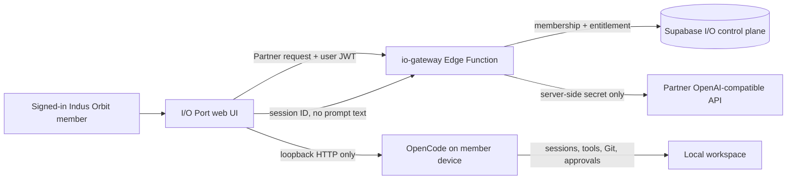

# I/O Port operating guide

## What is live in the demo project

I/O Port is one web workspace with two execution boundaries:

1. **Provider partnership route** — the browser calls the authenticated `io-gateway` Edge Function. The gateway verifies workspace membership and an active capacity grant before it reads a provider configuration from server-side secrets. It sends an OpenAI-compatible chat request, returns the answer, and writes an audit trail that excludes prompt and response text.
2. **I/O Terminal route** — the browser talks directly to a member's own OpenCode server running on loopback. OpenCode keeps the agent session, tool permissions, filesystem, terminal, and Git state on that device. I/O records only the connector origin and OpenCode session ID after the run succeeds.

The web surface is `/app/io`. It reuses the existing authenticated Indus Orbit shell, conversation dropdown, member context, missions, and skills rather than introducing another community system.

The nested I/O layout is still a **preview shell**: its workspace label, availability indicator, navigation counts and inspector activity cards are illustrative until the code-level roadmap connects each of them to authorized live data. The runnable session controls and capacity/audit cards in the overview are the current live demo elements.

## Data and control flow



The capacity tables maintain the distinction between partner, rented/owned, donated, and sponsored capacity. A source is never made routable merely because it exists: its operational status and workspace grant must both be active.

## Web UI behaviour

- A signed-in member without an I/O workspace sees a single **Create workspace** action. The authenticated `create_my_io_workspace` RPC creates (or safely recovers) the caller's personal tenant boundary, immutable owner membership and a minimal audit event as one transaction. It accepts no browser-supplied owner, workspace, destination or credential values.
- The capacity cards come from the member's real workspace grants and disclose source status and public terms.
- Selecting **I/O Terminal** allows only `localhost`, `127.0.0.1`, or `::1` over HTTP. The password field is in-memory only and never stored in Supabase.
- Selecting **Provider partnership** disables direct browser-provider access. The request goes through `io-gateway`, where membership, grant, source state, limits, and auditing are enforced.
- The audit panel deliberately stores route metadata, model identifier, token counts, connector origin, and session ID—not the prompt, response, raw key, or OpenCode password.
- Gateway version 3 separates HTTP handling, request validation, membership, capacity-policy checks, audit writing and the OpenAI-compatible adapter. Its public errors are structured; internal/provider details and credentials are not returned to the browser.

## Start a local OpenCode terminal

Install OpenCode on the member machine, then start a loopback server that explicitly allows the local Indus Orbit development origin. In this review session Indus Orbit is running on port `5174`; use `5173` instead if that is the port Vite assigns on a later start:

```bash
opencode serve --port 4096 --cors http://127.0.0.1:5174
```

For a password-protected server, set `OPENCODE_SERVER_PASSWORD` before starting OpenCode and enter that password in I/O Terminal. The UI uses the OpenCode HTTP APIs for health, session creation, and message delivery, so the user retains OpenCode's native sessions, tool approvals, diffs, terminal, and Git controls.

For a deployed Indus Orbit site, include its exact origin as an additional `--cors` value. Do not bind OpenCode to a public network interface just to use I/O Terminal.

## Enable the first provider partnership

The server gateway is deployed but deliberately has no provider credentials. Configure these as Supabase Edge Function secrets, never in the browser or source repository:

| Secret                     | Required value                                                |
| -------------------------- | ------------------------------------------------------------- |
| `IO_PARTNER_BASE_URL`      | HTTPS OpenAI-compatible API base URL, usually ending in `/v1` |
| `IO_PARTNER_API_KEY`       | Provider-issued credential                                    |
| `IO_PARTNER_DEFAULT_MODEL` | Approved model identifier                                     |

Then change `partner-gateway` and the target workspace grant from `onboarding` / `pending` to `active` through an audited admin workflow. The gateway will refuse to route if any of those conditions are unmet.

## Current demo records

The demo project has one member-owned `Indus Orbit demo` workspace and three visibly labelled sources:

- **Local OpenCode terminal** — active local-only route.
- **Partner model gateway** — awaiting a server secret and commercial activation.
- **Sponsored capacity commons** — awaiting sponsor terms and eligibility policy.

The deployed gateway accepts the standard local Vite origins on ports `5173` and `5174`, alongside the Indus Orbit production origins. Other origins remain rejected.

## Guardrails before public beta

1. Add an operator-only capacity management screen; the current browser UI is intentionally member-facing.
2. Add ledger and budget reservation tables before enabling paid traffic.
3. Add provider-specific evaluation, residency, retention, and fallback policy before activating multiple routes.
4. Add rate limiting, idempotency keys, and streaming/retry handling to `io-gateway` before broad access.
5. Run an external security review of the pre-existing Supabase SECURITY DEFINER warnings. The deliberate authenticated `create_my_io_workspace` RPC also appears in the Security Advisor because it is a `SECURITY DEFINER` function callable by signed-in members; it is restricted to no arguments, `auth.uid()`, an empty search path, and its own creator/membership/audit writes. Keep that invariant and re-review it whenever the function changes.
