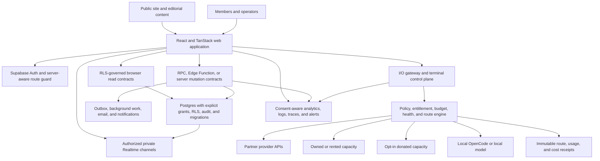
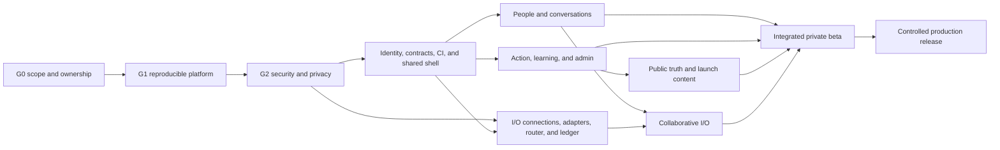

# Indus Orbit master implementation and release plan

Status: authoritative execution plan, updated 9 August 2026

Target: Indus Orbit Production v1, including the public site, member network, learning and action systems, administration, and I/O Port

Release state: not release-ready

Owners: assign by role before implementation begins

## 1. Purpose and authority

This is the cross-product source of truth for completing Indus Orbit. It covers the full product, not only I/O Port. It converts the existing prototypes, partial workflows, deployed demo data, and specialist plans into one ordered programme with measurable quality gates.

Use the documents in this order:

1. this plan defines scope, dependencies, sequencing, and the meaning of complete;
2. `RELEASE_READINESS_CHECKLIST.md` records evidence for every release gate;
3. `SUPABASE_SCHEMA_RECONCILIATION.md` governs migration-history recovery;
4. `io-system/io-port-system/IO_PORT_IMPLEMENTATION_STATUS.md` is the current operational truth for I/O Port;
5. the remaining I/O and conversation documents provide specialist design and delivery detail.
6. `io-system/FINALIZATION_EXECUTION_PLAN.md` records the current post-demo-release execution order, exit criteria and owner decisions.

When documents disagree, verified code and deployed-state evidence take priority, followed by this plan, then the specialist plan. Update the documents in the same change that alters architecture, scope, data contracts, or release status.

## 2. Definition of the finished product

Production v1 is complete only when a real member can safely move through the whole Indus Orbit journey:

1. discover Indus Orbit through an accessible, accurate, search-ready public site;
2. request access or accept an invitation, authenticate, give required consent, and complete onboarding;
3. build a trustworthy profile and discover people, skills, chapters, missions, events, learning, and ideas;
4. connect, vouch, message, mentor, participate, learn, and receive notifications with appropriate privacy controls;
5. create or manage approved community activity through explicit role and moderation workflows;
6. use I/O Port through governed provider, owned/rented, sponsored, or local capacity with understandable route and cost receipts;
7. obtain support, export or delete eligible personal data, and rely on documented operational and incident processes;
8. use the application on mobile and desktop without critical accessibility, integrity, security, or reliability failures.

A screen existing is not completion. Completion requires working data contracts, authorization, error states, tests, telemetry, operating documentation, and rollback evidence.

## 3. Verified baseline

The following baseline was inspected against the local repository and connected demo Supabase project on 31 July 2026.

| Product area                  | Current state                                                                                                                                                                | Production gap                                                                                                                                              |
| ----------------------------- | ---------------------------------------------------------------------------------------------------------------------------------------------------------------------------- | ----------------------------------------------------------------------------------------------------------------------------------------------------------- |
| Public website                | Major pages and writing routes exist                                                                                                                                         | Content truth, real links, legal pages, consent, SEO consistency, analytics governance, and editorial workflow remain                                       |
| Authentication and onboarding | Password, Google, reset, request-access, session context, and onboarding UI exist                                                                                            | Server-aware route protection, invitation enforcement, production email, abuse prevention, MFA for privileged users, recovery, and privacy lifecycle remain |
| App shell                     | Branded sidebar, top bar, notifications, quick chat, and I/O nested shell exist                                                                                              | One responsive Discord-like spatial system, common loading/error patterns, accessibility, and navigation state remain                                       |
| People and trust              | Directory, profiles, connections, endorsements, reports, vouch, mentorship, and roles exist                                                                                  | Low-volume workflows are unproven; several mutations need atomic server boundaries and abuse controls                                                       |
| Conversations                 | Direct messages, unread state, compact chat and a remotely Verified caller-bound send/read RPC boundary exist                                                                | Add shared store, cursor pagination, private outbox/realtime, explicit blocking and reliability/load tests                                                  |
| Action systems                | Missions, chapters, events, stories, board, and related admin routes exist                                                                                                   | State machines, transactional writes, seeded acceptance flows, moderation consistency, and end-to-end proof remain                                          |
| Learning and knowledge        | Academy, courses, lessons, quizzes, Skills and SODA exist; the former Loops product is remotely retired and preserved only as a service-role-readable archive                | Archive retention, server-side quiz grading, storage, editorial provenance, outage truth, canonical metadata and learner analytics remain                   |
| Administration                | Dashboard and specialised admin screens exist                                                                                                                                | Central permission contracts, MFA, audit completeness, queues, bulk-operation safety, concurrency handling, and role-matrix tests remain                    |
| I/O Port                      | Product shell, control plane, local OpenCode proof, registry-driven gateway, five staged providers, latest-evidence routing and product split are Released to demo           | Conformance, idempotency/health/budget controls, ledger, durable terminal, 15 more provider inventories and full operator UI remain                         |
| Supabase platform             | Active demo project; eight new migrations and 17/17 live checks pass; public generated types match; anonymous privileged-function warnings are zero                          | 26 migration aliases, full 59-migration CI, managed Realtime, 40 authenticated function audits and performance-policy backlog remain                        |
| Engineering quality           | Production build, TypeScript, formatting, repository lint, configuration unit tests and high-severity dependency audit pass locally; a GitHub quality workflow is configured | Feature/integration/database test coverage and an executed CI history remain incomplete                                                                     |
| Deployment and operations     | Cloudflare configuration and Supabase project exist                                                                                                                          | Environment strategy, secret lifecycle, protected deployments, observability, load testing, backups/restore drills, and incident runbooks remain            |

Known release blockers include:

- remote history is preserved, but 26 timestamp aliases still need a durable source strategy;
- 40 authenticated `SECURITY DEFINER` warnings require contract-by-contract review; anonymous warnings are now zero;
- anonymous insert policies for contact and newsletter data require proper anti-abuse and data-minimisation controls;
- leaked-password protection is disabled;
- current warning-level Performance Advisor results include 112 RLS init-plan and 97 multiple-permissive-policy findings; no error-level advisor issue exists;
- the education upload path expects an `education` storage bucket, but no storage bucket is deployed;
- quiz correctness can currently be exposed to or evaluated by browser-facing code;
- vouch issuance remains browser-initiated; Web Crypto reduces predictability, but authoritative server-side issuance, hashing, and rate limits are still required;
- the production build contains a 645.40 kB minified JavaScript chunk; route/vendor splitting and measured performance budgets remain required;
- browser-facing feature data adapters are named `*.server.functions.ts`, obscuring the real trust boundary;
- `/models` publishes hard-coded model, price, and exchange-rate facts without a versioned evidence process;
- five provider records are staged but have no passed conformance evidence, and every runtime switch remains off, so provider keys alone do not activate routing;
- repository CI is configured for audit, format, lint, types, unit tests and build, but automated database authorization, complete end-to-end and load suites remain absent.

## 4. Non-negotiable implementation rules

### 4.1 People at the centre

- Explain automated decisions, route provenance, moderation outcomes, and material data use in plain language.
- Provide accessible human support and appeal paths for account, moderation, vouch, and sponsored-capacity decisions.
- Never present donated or sponsored compute as unrestricted capacity; disclose its source class and applicable policy.
- Do not infer India residency, provider origin, privacy, or sovereignty from a model name. Store and display evidence-backed model origin, serving region, capacity operator, and data-handling policy separately.

### 4.2 One authoritative trust boundary

- Browser code may read and mutate only through deliberately granted RLS-safe contracts.
- Privileged and multi-table mutations run through reviewed Postgres RPCs, Edge Functions, or authenticated TanStack server functions.
- Service-role credentials never enter browser bundles and are used only inside the smallest possible privileged runtime.
- Every mutation has an authorization contract, validation schema, idempotency rule, audit rule, and error contract.

### 4.3 Forward-only, reproducible data changes

- Reconcile the local and remote migration histories before further structural work.
- Every schema change is a fresh migration that replays from zero in CI and a resettable non-production database. A paid hosted branch is optional and requires separate approval; it is not part of this plan.
- Generate database types after migrations and fail CI on drift.
- Explicitly grant only the required Data API privileges and pair them with RLS. New tables are not assumed to be automatically exposed.
- Do not mutate the Supabase Realtime schema. Use reviewed policies on `realtime.messages` for private Broadcast authorization.

### 4.4 Honest states

- Demo, preview, unavailable, stale, and live data are visibly distinct.
- Fallback content never silently masks a live-data outage.
- Marketing claims, provider facts, prices, model availability, benchmarks, and India-residency statements require evidence, effective dates, and owners.

### 4.5 Evidence before release

- No checklist item is complete without a commit, test report, migration result, screenshot, monitoring query, or signed approval linked in the release record.
- Security, privacy, accessibility, recovery, and data-integrity failures cannot be waived solely to meet a date.
- Production rollout uses staged exposure and a documented rollback or kill switch.

## 5. Target architecture



The product uses one shared visual system: workspace rail, contextual navigation, primary content, and optional inspector. Public pages may use a simpler shell, but typography, colour, tokens, focus treatment, motion, and content voice must remain recognisably Indus Orbit.

## 6. Definition of Done for every implementation slice

Every feature, migration, or infrastructure change must satisfy all applicable items:

1. **Product:** acceptance criteria, non-goals, permissions, empty/loading/error/offline states, and content copy are approved.
2. **Design:** desktop and mobile behaviour, keyboard operation, focus order, screen-reader labels, contrast, reduced motion, and responsive overflow are verified.
3. **Data:** migration is forward-only and replayable; grants, RLS, indexes, constraints, ownership, retention, and deletion behaviour are explicit.
4. **Security:** input/output validation, authentication, authorization, abuse controls, secret handling, audit event, and threat cases are tested.
5. **Integrity:** multi-step mutations are atomic; retries are idempotent; concurrent updates have a defined result; money and capacity use integer units and immutable ledgers.
6. **Code:** generated types are current; no unexplained `any`; lint, format, TypeScript, unit, integration, database, and applicable end-to-end tests pass.
7. **Operations:** structured telemetry contains no prohibited content or secrets; alerts, dashboard, runbook, support path, and rollback are documented.
8. **Documentation:** user, operator, API, schema, and decision documents are updated in the same change.
9. **Evidence:** the readiness checklist links the change, tests, and reviewer approval.

## 7. Workstreams

### W0. Programme control, repository, and documentation

**Goal:** create one reviewable engineering system instead of parallel plans and untracked local knowledge.

Deliverables:

- appoint Product, Design/Content, Web, Platform/Supabase, I/O, QA/Security, and Operations/Legal owners;
- add a root `README.md` with setup, architecture, environments, scripts, demo personas, and support paths;
- add `CONTRIBUTING.md`, code-review rules, architecture-decision records, release notes, and a documentation index;
- define statuses as `Not started`, `In progress`, `Blocked`, `Verified`, and `Released`;
- track every planned item in one issue/project system with workstream, dependency, owner, risk, release, and evidence fields;
- protect the main branch; require passing checks and at least one qualified review for application changes and Platform/Security review for database or auth changes;
- separate demo, staging, and production data and visibly label every non-production environment;
- record accepted decisions for v1 scope, invitation policy, moderation ownership, data residency claims, monetisation, sponsored capacity, and support hours.

Exit criteria:

- every workstream has an accountable owner and issue set;
- every release checklist item maps to an issue and evidence location;
- no active document contradicts the verified implementation status.

### W1. Supabase platform, migrations, security, and data integrity

**Goal:** make the database and authorization layer reproducible, least-privileged, and safe for real users.

Deliverables:

1. recover missing migration history using `SUPABASE_SCHEMA_RECONCILIATION.md`;
2. replay all migrations in a resettable local or non-production database and compare schemas, enums, grants, RLS policies, functions, triggers, extensions, and seed data with the demo project;
3. generate current TypeScript types and add schema-drift and migration-replay CI;
4. inventory each `SECURITY DEFINER` function with purpose, permitted roles, ownership, `search_path`, internal authorization, input validation, audit event, and tests;
5. revoke `PUBLIC` and `anon` execution unless explicitly required; move internal helpers out of the exposed API schema where practical;
6. replace anonymous permissive contact/newsletter writes with a rate-limited server contract using a honeypot and verified challenge, minimal PII, duplicate handling, and retention policy;
7. enable leaked-password protection and configure production Auth protections;
8. optimise RLS expressions, consolidate overlapping permissive policies where semantics allow, add verified missing foreign-key indexes, and review unused indexes against real query evidence before removal;
9. define data retention, export, anonymisation, deletion, backup, point-in-time recovery, and legal-hold behaviour by table;
10. configure SSL enforcement, network restrictions where practical, privileged-user MFA, log retention, and security alerts;
11. adopt current Supabase publishable/secret key conventions and rotate legacy keys through a documented dual-key procedure;
12. design new Data API tables for explicit opt-in: grants plus RLS, not accidental schema exposure.

Tests:

- SQL/pgTAP role matrix for anonymous, member, lead, editor, investor, expert, admin, suspended, and service roles;
- negative tests for horizontal and vertical privilege escalation;
- migration replay from empty database and upgrade from a production-like snapshot;
- concurrent mutation, idempotency, and rollback tests;
- backup restore drill with measured recovery time and recovery point.

Exit criteria:

- local, staging, and production migration histories are explainable and reproducible;
- Security Advisor has no unexplained error/warning affecting exposed contracts;
- Performance Advisor findings are resolved or documented with benchmark evidence and an owner;
- authorization tests pass in CI and after deployment.

Implementation evidence updated 9 August 2026:

- **Verified locally:** the full checked-in migration chain replays from an empty database after three documented historical/environment recovery corrections;
- **Verified locally:** all 58 migrations replay and 269 pgTAP assertions cover critical schema/grants, notification owner access, caller-bound direct-message mutation/idempotency, endpoint-bound latest-conformance routing, guarded vouch/audit contracts, the read-only Loops archive, I/O/Community product separation and global-location privacy;
- **Verified locally:** public/private schema lint and error-level Supabase security/performance advisors report no findings;
- **Released to demo:** eight current migrations are recorded, the read-only release contract passes 17/17, public generated types match, all provider runtime switches remain off and provider traffic evidence is zero;
- **Security improvement:** eight anonymous privileged-function warnings were removed; 40 authenticated function warnings and leaked-password protection remain;
- **Implemented, current CI evidence pending:** `.github/workflows/database.yml` replays migrations, runs pgTAP and fails on database lint errors; local Storage health prevented the fresh 59-migration/285-test run;
- **Partial containment:** anonymous notification access is removed and direct messages no longer call the generic notification RPC; remaining browser-domain callers are temporarily compatible and high risk;
- **Blocked for release:** the deployed browser-callable email dispatcher accepts arbitrary recipient/subject/HTML and must be replaced by a fixed-template, service-only outbox worker;
- **Still required:** durable migration-alias reconciliation, full schema-object comparison, managed Realtime verification, authenticated SECURITY DEFINER inventory, backup/restore and environment separation.

### W2. Engineering foundation, CI/CD, and observability

**Goal:** make every merge and deployment repeatable, diagnosable, and reversible.

Deliverables:

- add scripts for `format:check`, `lint`, `typecheck`, unit tests, database tests, integration tests, end-to-end tests, build, and bundle analysis;
- keep repository lint at zero errors and prohibit new lint debt immediately;
- introduce Vitest and React Testing Library for domain and component tests, Playwright for persona journeys, pgTAP/SQL for authorization, axe for automated accessibility, and k6 or equivalent for load tests;
- create pull-request CI and protected staging/production deployment workflows;
- pin supported Node and package-manager versions and add deterministic dependency installation;
- add dependency, secret, license, and static-analysis checks;
- centralise error boundaries, typed error codes, request/correlation IDs, and user-safe failure messages;
- define structured logs, consent-aware product analytics, performance telemetry, uptime checks, alert routes, and data-redaction rules;
- create staging smoke tests and automatic post-deployment health checks;
- define rollback for web deployments, Edge Functions, feature flags, and forward-fix database migrations.

Initial CI sequence:

```text
install -> format:check -> lint -> typecheck -> unit -> database/RLS -> build
        -> integration -> end-to-end smoke -> accessibility -> deploy preview
```

Exit criteria:

- every main-branch commit passes required checks;
- staging deploys automatically and production requires an approved release record;
- an operator can identify a failing request by correlation ID without viewing protected prompt, message, or personal content;
- a failed web or function deployment can be rolled back using a rehearsed runbook.

### W3. Identity, access, onboarding, privacy, and trust

**Goal:** make account entry and the role system secure, understandable, and recoverable.

Deliverables:

- replace client-only protected-route gating with server-aware authentication and onboarding checks while retaining client session refresh;
- enforce invitation/request-access policy at the trusted mutation boundary;
- configure production redirect allowlists, custom SMTP, email confirmation, OTP expiry, password recovery, and provider-specific OAuth settings;
- require MFA for admin and other privileged roles; support session review and revocation;
- define and test role capabilities centrally instead of duplicating role checks across pages;
- implement suspended, removed, incomplete-onboarding, and deleted-account states consistently;
- add privacy settings, notification consent, data export, account deletion request, terms acceptance, and consent-version records;
- build an operator-safe request-access queue with reasoned decisions and audit entries;
- add server-side rate limiting and abuse detection to auth, recovery, request-access, contact, and newsletter flows;
- add a user-visible security and privacy history where appropriate.

Exit criteria:

- all persona and denial paths pass end-to-end tests;
- no protected content flashes before redirect;
- privileged accounts enforce MFA;
- recovery, suspension, export, and deletion procedures have operator runbooks and test evidence.

### W4. Shared branded shell and design system

**Goal:** deliver the Discord-like spatial clarity requested by the product while preserving Indus Orbit's own scientific, people-centred identity.

Deliverables:

- define design tokens for colour, typography, density, spacing, radii, elevation, icons, motion, focus, and data visualisation;
- implement one responsive shell with workspace rail, contextual navigation, main canvas, optional inspector, command/search access, and mobile drawers;
- create shared primitives for page headers, cards, tables, forms, filters, dialogs, toasts, skeletons, empty/error states, status badges, activity timelines, and data provenance;
- keep Orbit, People, Action, Learn, and I/O information architecture stable across desktop and mobile;
- persist UI preferences only when useful and synchronise account-level preferences where cross-device behaviour matters;
- ensure keyboard navigation, skip links, landmarks, screen-reader announcements, visible focus, touch targets, contrast, zoom, and reduced motion;
- add a visual regression suite for critical routes and a component catalogue or equivalent documentation;
- replace preview counts or static health indicators with live data, or label them unambiguously as examples.

Exit criteria:

- critical routes pass WCAG 2.2 AA review;
- no critical mobile overflow or keyboard trap remains;
- product areas use the shared shell and components instead of parallel layout systems;
- visual regressions are reviewed in CI.

### W5. People, profiles, connections, vouch, and mentorship

**Goal:** make the social trust graph safe, useful, and operational under real use.

Deliverables:

- complete profile field ownership, visibility, verification, search indexing, and public/private presentation rules;
- implement paginated directory search, role/skill/location filters, privacy-aware results, and empty/error states;
- make connection request, accept, reject, cancel, block, unblock, and removal atomic and auditable;
- define endorsement eligibility, uniqueness, revocation, display, and abuse/report handling;
- replace transitional browser-side Web Crypto vouch issuance with cryptographic server-issued codes, store only safe hashes where feasible, and enforce expiry, attempt limits, rate limits, atomic redemption, and audit;
- formalise direct-vouch and request-vouch authorization and appeal flows;
- make mentor requests, acceptance, scheduling state, completion, feedback, cancellation, and notification transitions transactional;
- use an outbox/idempotent delivery design for mentorship and other email-triggering events;
- add member reporting, blocking, privacy, and trust-and-safety support throughout people surfaces.

Exit criteria:

- connection, vouch, endorsement, block, and mentorship state machines pass role and concurrency tests;
- codes cannot be guessed, replayed, logged in plaintext, or redeemed twice;
- every trust decision has a visible state and an operator audit trail.

### W6. Conversations, notifications, and collaborative presence

**Goal:** create a dependable conversation layer that can support people, groups, community work, and I/O without mixing incompatible data.

Deliverables:

- finish one shared conversation store for full Messages and compact chat;
- deploy the locally Verified caller-bound send/read RPCs, then extend them with explicit block state, private-outbox projection and safe metadata-only audit where operationally required;
- add cursor pagination, deterministic ordering, deduplication, optimistic reconciliation, retry, and offline/reconnect behaviour;
- authorise private Realtime Broadcast channels using RLS policies on `realtime.messages`; do not alter the locked Realtime schema;
- implement block-aware presence, typing indicators, read receipts, unread reconciliation, and notification preferences without leaking activity to unauthorised users;
- define bounded rate limits, spam controls, retention, export, deletion, and report workflows;
- add scoped group conversations only after direct-message contracts pass load and authorization tests;
- keep human direct messages separate from I/O prompts, model responses, tool traces, and terminal artifacts; link them only through explicit references and consent;
- implement an idempotent notification/outbox pipeline with delivery attempts, preference checks, retries, and dead-letter handling.
- make every email worker service-only and template-driven; no browser contract may accept an arbitrary recipient, subject or HTML body.

Exit criteria:

- message and notification invariants pass multi-session, reconnect, duplicate-delivery, block, and access-revocation tests;
- p95 send-to-visible latency and unread correctness meet documented service objectives at beta load;
- no unauthorised realtime subscription receives event payloads.

### W7. Missions, chapters, events, stories, and board

**Goal:** turn existing action surfaces into explicit, moderated community workflows.

Deliverables:

- document state machines and role capabilities for each domain before changing implementation;
- move create/join/leave/approve/reject/publish/archive/RSVP operations that span tables into atomic mutation contracts;
- add optimistic concurrency or version checks to administrative decisions;
- provide reason fields, audit events, member notifications, appeal/correction paths, and safe bulk actions;
- add cursor pagination, search, filters, ownership display, dates/time zones, and consistent empty/loading/error states;
- define content sanitisation and rendering rules for member-authored text and links;
- seed staging with approved fixtures for every state, including rejected, cancelled, archived, full-capacity, suspended-owner, and expired cases;
- ensure board and investor views expose only authorised, intentionally published data;
- add lifecycle jobs for reminders, expiry, archival, and notification fan-out using idempotent background processing.

Exit criteria:

- one Playwright journey per persona completes and reverses every critical workflow;
- no partial row sets remain after failed multi-table operations;
- moderation and publication decisions have complete reasoned audit history;
- member-authored content is rendered safely.

### W8. Academy, Skills, SODA, and knowledge integrity

**Goal:** make learning and knowledge content trustworthy, measurable, and maintainable.

Deliverables:

- create the `education` storage bucket through migration/configuration with explicit object RLS, type/size limits, signed access, lifecycle rules, and malware/content review strategy;
- move quiz scoring into an atomic server/RPC transaction; prevent members from reading answer keys or writing arbitrary results;
- define attempts, pass rules, retry windows, progress calculation, completion, certificates/credentials, and administrator correction;
- remove broad `any` casts from education data access and regenerate types;
- add course/module/lesson ordering constraints and editorial draft/review/publish/archive workflows;
- define canonical ownership, evidence, effective date, version, and moderation for Skills and SODA content;
- replace silent SODA fallback with explicit cached/stale/unavailable behaviour and visible provenance;
- add search, related-content links, learner progress, completion telemetry, accessible media/transcripts, and mobile lesson behaviour;
- review all seeded content for rights, accuracy, tone, and publication approval.

Exit criteria:

- a learner cannot inspect answer keys or forge progress/results through the Data API;
- upload/download access passes owner/editor/admin role tests;
- a complete learner and editor journey passes end to end;
- every public knowledge item exposes version/provenance and a correction route.

### W9. Public site, editorial system, models observatory, SEO, and legal content

**Goal:** make indusorbit.com accurate, discoverable, credible, and legally operable.

Deliverables:

- approve the information architecture and content for Home, About, Our Work, What is Indus Orbit, I/O Port, Models, Writing, Members, Contact, and supporting pages;
- replace placeholder social/contact links and legacy `indus-spark-connect.lovable.app` canonical URLs;
- add consistent canonical URLs, titles, descriptions, Open Graph/Twitter cards, structured data, sitemap, robots rules, and social-preview assets;
- build an editorial draft/review/publish/version/archive workflow rather than hard-coded claims for content that changes;
- convert `/models` to a versioned model/price/benchmark evidence registry with source, retrieval date, currency/FX version, methodology, model lifecycle, and correction process;
- clearly distinguish model developer origin, serving provider, region, privacy/retention, and route capacity class;
- add Terms, Privacy, Cookie/Storage notice, Acceptable Use, Community Guidelines, AI/Model disclosure, Sponsored Capacity disclosure, and contact/support information;
- replace simple acknowledgement-only cookie UI with a consent system proportionate to the actual analytics and marketing tools in use;
- run link, spelling, content-truth, accessibility, performance, and SEO audits before release.

Exit criteria:

- all public facts have an owner and evidence date;
- there are no placeholder, legacy-domain, broken, or unapproved links;
- critical public pages meet accessibility, Core Web Vitals, metadata, and structured-data targets;
- legal and disclosure content is approved for the intended launch jurisdictions.

### W10. Administration, moderation, support, and audit

**Goal:** allow authorised operators to run the network safely without relying on database-console access.

Deliverables:

- centralise admin route guards and server-side permission checks;
- require MFA and short-lived privileged sessions where supported;
- unify queues for access requests, verification, reports, vouches, content, roles, education, SODA, Skills, missions, chapters, events, and stories;
- add pagination, filters, assignment, priority, SLA age, reason codes, notes, evidence links, and optimistic concurrency;
- require re-authentication or confirmation for high-impact actions and make bulk actions previewable and bounded;
- make audit entries append-only, actor-aware, target-aware, reasoned, correlated, and exportable to authorised reviewers;
- provide reversible suspension/publication actions where safe and explicit irreversibility warnings where not;
- create support tooling for account recovery, consent history, notification delivery, data export/deletion, and I/O receipt investigation without exposing unnecessary content;
- add feature flags and kill switches with ownership and audit.

Exit criteria:

- every privileged action fails closed in browser, API, and realtime tests;
- operators can resolve each supported queue without direct SQL;
- audit records are sufficient to reconstruct who did what, when, why, and through which request.

### W11. I/O Port, multi-provider routing, terminal, and capacity economy

**Goal:** deliver India's people-centred AI access port as a governed, transparent exchange, not a single overwritten provider secret.

The detailed implementation status and route design remain in `io-system/io-port-system/IO_PORT_IMPLEMENTATION_STATUS.md`, `io-system/io-port-system/IO_PORT_CODE_LEVEL_ROADMAP.md`, and `io-system/io-port-system/IO_PORT_IMPLEMENTATION_PLAN.md`. The cross-product sequence is:

1. **Connection resolver:** local source now replaces the three global `IO_PARTNER_*` values with approved endpoint connections using restricted secret references, not stored plaintext. Replay/deploy it and extend it for partner, owned/rented, sponsored/donated, BYOK, and local classes.
2. **Registry operations:** build reviewed provider/model/endpoint onboarding, versioned capability and pricing records, lifecycle state, evidence, and health inputs.
3. **Adapters and conformance:** local source implements non-streaming OpenAI-compatible and Gemini-native response/usage normalization. Define stream, tool and full error contracts and certify each endpoint/model/capability combination before routing.
4. **Policy router:** local source hard-filters entitlement, capability, context, lifecycle and current price, then selects latest-affordable, lowest-cost or explicit model deterministically. Add model origin, serving region, privacy/retention, capacity class, budget, contract and health before activation.
5. **Route transaction:** local source records safe attempts, bounded fallback and an immutable receipt migration. Add idempotency, versioned policy/health snapshots, reserves, settlement and release before any paid/shared traffic.
6. **Pricing and ledger:** store provider cost, I/O fee/subsidy, tax treatment, FX version, sponsored credit, reservation, settlement, refund, and balance adjustments as immutable integer-minor-unit ledger entries.
7. **Member API and web UI:** expose authorised catalog, policies, estimate, route, stream, cancel, receipt, usage, budget, and API-key endpoints; show why a route was chosen and disclose provider, model revision, capacity class, region, data policy, estimate/actual cost, and fallback.
8. **I/O terminal:** extend the local OpenCode proof with durable session metadata, resume, task tree, tools, approvals, diffs, artifacts, logs, cancellation, reconnect, and explicit content-sharing controls. Local content remains local by default.
9. **Collaborative I/O:** add workspace conversations, human mentions, run/artifact references, and approvals only after the general conversation contract is complete; never place raw I/O content into direct messages implicitly.
10. **Operations:** provider health, rate limits, queue state, circuit breakers, reconciliation, fraud/abuse, spend alerts, capacity allocation, sponsor controls, incident response, and provider offboarding.

I/O exit criteria:

- at least two genuinely independent capacity routes pass the same conformance suite and a controlled failover exercise;
- no endpoint without effective price, capability, contract, privacy, lifecycle, health, and secret-reference records is routable;
- estimates, reservations, settlements, and receipts reconcile under success, cancellation, retry, fallback, timeout, and provider-error tests;
- the UI never claims a provider, model, India region, residency, price, or sponsored benefit that is not supported by the selected receipt;
- users can delete or export retained I/O metadata according to policy, while financial/audit retention remains lawfully separated;
- provider keys are set through an operator secret process and never through GitHub source or the member browser.

### W12. Commercial model, capacity partnerships, governance, and legal operations

**Goal:** make the product sustainable without obscuring cost, subsidy, or influence.

Deliverables:

- define user types: visitor, learner, community member, builder, team, institution, partner, sponsor/donor, provider, and operator;
- model unit economics using measured token/media/tool/storage/egress/support/fraud/payment/tax costs rather than static competitor mark-ups;
- define free/community allocations, paid usage, team budgets, sponsored credits, donated capacity, BYOK, refunds, expiry, and fair-use rules;
- separate provider cost, I/O service fee, subsidy, discount, tax, and FX on receipts;
- create provider and donor due-diligence requirements for availability, security, privacy, jurisdiction, model origin, acceptable use, incident notice, audit rights, and exit/export;
- prohibit sponsor access to member prompts, outputs, private messages, or identity beyond explicit aggregated reporting;
- obtain review of privacy, consumer, tax, payments, intermediary/platform, AI disclosure, accessibility, copyright, and data-transfer obligations in launch jurisdictions;
- define complaint, takedown, incident, breach, provider outage, billing dispute, and law-enforcement request procedures;
- establish governance for model/provider suspension and transparent change notices.

Exit criteria:

- every priced route can be reconciled from provider invoice through member receipt and ledger;
- sponsored/donated capacity has explicit member consent and sponsor-isolation controls;
- partnership and member terms are approved before public paid usage;
- commercial claims are traceable to current measured assumptions.

### W13. Quality engineering and release operations

**Goal:** prove that the assembled product works under realistic role, device, failure, and load conditions.

Required test layers:

| Layer         | Required coverage                                                                                                      |
| ------------- | ---------------------------------------------------------------------------------------------------------------------- |
| Static        | Format, lint, TypeScript, dependency, secret, license, and build checks                                                |
| Unit          | State machines, validation, pricing, routing, permission helpers, reducers, and formatting                             |
| Component     | Forms, dialogs, tables, shell navigation, empty/error/loading, keyboard, and screen-reader semantics                   |
| Database      | Grants, RLS, functions, constraints, triggers, idempotency, concurrency, audit, and migration replay                   |
| Integration   | Auth, email/outbox, storage, realtime, provider adapters, payment/billing if enabled, and analytics redaction          |
| End to end    | Visitor and every role persona across public, onboarding, network, action, learning, admin, and I/O journeys           |
| Accessibility | Automated axe plus manual keyboard, screen-reader, zoom, contrast, motion, and mobile review                           |
| Performance   | Core Web Vitals, route/bundle budgets, query plans, API latency, realtime fan-out, and I/O time to first token         |
| Resilience    | Provider timeout/rate limit, email failure, realtime reconnect, duplicate webhook/event, DB contention, and rollback   |
| Security      | Abuse, auth bypass, IDOR, RLS, secret exposure, injection, unsafe rendering, upload, rate-limit, and dependency review |
| Recovery      | Backup restore, web/function rollback, reconciliation, data export/deletion, and incident communication drills         |

Quality targets must be recorded before beta. At minimum:

- zero open critical/high security findings for in-scope paths;
- zero known cross-tenant or cross-role authorization failures;
- zero critical WCAG 2.2 AA failures in core journeys;
- 100% automated coverage of critical permission and financial/routing invariants;
- documented p95/p99 objectives for page/API/message/realtime/I/O operations based on beta load tests;
- no silent data loss, false-success UI, or unlabelled stale/demo data;
- backup restoration and rollback completed inside approved recovery objectives.

Exit criteria:

- the release checklist is fully evidenced and approved;
- a release candidate remains stable through the defined soak period;
- incident, rollback, and support drills have named responders and recorded results.

## 8. Ordered implementation waves

The waves are dependency gates, not calendar promises. Work may run in parallel only when its inputs are stable and it cannot bypass a gate.

### Wave 0 — Truth, ownership, and release control

Scope: W0 plus release tracking.

- assign owners and approve Production v1 scope;
- capture all work in the tracker;
- document environments and current evidence;
- freeze new structural database work until history is reconciled;
- require “no new lint debt” and manual security review for interim changes.

Exit: Gate G0 passes.

### Wave 1 — Platform recovery and security containment

Scope: W1 and the minimum W2 CI.

- recover migration history and prove replay in a resettable local or non-production database;
- audit function exposure, grants, RLS, anonymous forms, keys, and Auth settings;
- add database authorization tests and baseline CI;
- establish backup/restore and environment separation.

Exit: Gates G1 and G2 pass. No other work may claim production readiness before this.

### Wave 2 — Engineering and shared product foundation

Scope: W2, W3, and W4.

- establish the real browser/server boundaries and typed contracts;
- complete identity/session/role/privacy foundations;
- deliver the shared responsive branded shell and design primitives;
- create test fixtures, observability, and deployment previews.

Exit: Gates G3 and the foundation portion of G4 pass.

### Wave 3 — Core member network

Scope: W5 and W6.

- complete profiles, search, connections, vouch, mentorship, messages, notifications, blocks, reports, and realtime;
- validate at beta-scale concurrency and reconnect behaviour.

Exit: member-network acceptance suite passes and no trust-critical workaround remains.

### Wave 4 — Community action, knowledge, and administration

Scope: W7, W8, and W10.

- complete atomic community workflows and moderation;
- secure education grading/storage and knowledge provenance;
- give operators safe queues, audit, support, and kill switches.

Exit: all action/learning/admin persona journeys and integrity tests pass.

### Wave 5 — Public trust and launch content

Scope: W9 plus legal/content portions of W12.

- publish reviewed content and legal/disclosure pages;
- operationalise the models observatory and SEO;
- complete accessibility, performance, consent, and public abuse controls.

Exit: Gates G5 and G7 pass for the public and member product.

### Wave 6 — I/O Port production capability

Scope: W11 plus I/O commercial and operations portions of W12.

- build provider registry operations, multiple secret-resolved connections, adapters, conformance, routing, receipts, budgets, ledger, terminal, member API/UI, and operator control room;
- onboard providers/capacity only after contracts, evidence, and conformance pass.

Exit: I/O-specific Gate G4, G6, and G7 criteria pass, including two-route failover and reconciliation.

### Wave 7 — Integrated private beta

Scope: complete product through W13.

- use an allowlisted cohort and non-production/demo-safe content;
- measure member journeys, support load, accessibility, performance, provider quality, cost, abuse, and incident response;
- correct severity 0/1/2 issues and re-run all gates;
- perform data migration, backup/restore, rollback, and provider outage drills.

Exit: Gate G8 passes after the agreed soak period and owner sign-off.

### Wave 8 — Production release and controlled expansion

- deploy an immutable release candidate through staging to production;
- enable features and capacity in bounded cohorts with kill switches;
- monitor technical, trust, cost, content, and support indicators;
- publish current status, disclosures, and support routes;
- run 24-hour, 72-hour, 7-day, and 30-day reviews and record decisions.

Exit: Gate G9 passes; ongoing operations move to service-level and quarterly control reviews.

## 9. Release gates

| Gate                                           | Purpose                                                                                         | Required decision                 |
| ---------------------------------------------- | ----------------------------------------------------------------------------------------------- | --------------------------------- |
| G0 — Scope and ownership                       | One product definition, owners, tracker, and decision log                                       | Product owner + engineering owner |
| G1 — Reproducible environments                 | Local, resettable non-production, and production schema/config/deploy path are reproducible     | Platform + release owner          |
| G2 — Security and privacy                      | Auth, grants, RLS, functions, secrets, abuse, retention, and legal controls pass                | Security/privacy + platform owner |
| G3 — Data integrity                            | Transactions, idempotency, concurrency, audit, storage, migration, and recovery pass            | Platform + domain owner           |
| G4 — Feature acceptance                        | Every critical persona journey works with real contracts and failure states                     | Product + QA + domain owner       |
| G5 — Experience quality                        | Accessibility, mobile, performance, content truth, SEO, and design consistency pass             | Design/content + QA               |
| G6 — Reliability and operations                | Monitoring, alerting, load, reconciliation, backup, rollback, and incident drills pass          | Operations + engineering          |
| G7 — Commercial, provider, and legal readiness | Pricing, provider/donor contracts, support, disclosures, and policies pass                      | Business/legal + product          |
| G8 — Private beta                              | Cohort, soak, support, metrics, incident results, and defect threshold pass                     | Cross-functional release council  |
| G9 — Production                                | Immutable release, staged rollout, monitoring, rollback authority, and communications are ready | Named release owner               |

The detailed evidence fields and checkboxes live in `RELEASE_READINESS_CHECKLIST.md`.

## 10. Dependency map



Critical ordering rules:

- migration reconciliation precedes structural schema expansion;
- central authorization precedes admin and collaboration expansion;
- atomic domain contracts precede realtime fan-out;
- conversation reliability precedes workspace/group/I/O collaboration;
- provider connection resolution and conformance precede routing;
- route receipts and ledger invariants precede paid or sponsored public usage;
- content evidence and legal approval precede public model, sovereignty, privacy, pricing, or capacity claims.

## 11. Environment, data, and rollout strategy

### Environments

- **Local:** reproducible Supabase stack or other resettable non-production database, synthetic fixtures, provider mocks, no production secrets.
- **Preview:** per-pull-request web build, isolated or safely shared staging APIs, synthetic personas, no indexed public exposure.
- **Staging:** production-like schema/config, test provider accounts, email sink/test domain, load-test permission, seeded acceptance data.
- **Production:** least-privileged keys, real SMTP/provider contracts, protected deploy, approved retention, monitoring, backups, and on-call ownership.

### Persona fixtures

Maintain synthetic anonymous, invited, incomplete, member, youth, expert, investor, lead, editor, admin, suspended, blocked-pair, mentor, learner, sponsor, provider-operator, and I/O workspace personas. Seed every workflow state needed by automated tests. Never copy production personal or prompt data into lower environments.

### Rollout

1. internal operator cohort;
2. trusted member cohort;
3. invited private beta;
4. production with restricted creation and capped I/O capacity;
5. measured expansion by feature, geography, capacity class, and user type.

Use feature flags for high-risk workflows, provider routes, sponsored capacity, realtime collaboration, payment, and public publication. Every flag has an owner, default, expiry/review date, telemetry, and kill procedure.

## 12. Operating cadence and plan maintenance

### Weekly delivery review

- update issue and workstream statuses;
- attach test, migration, design, security, and operational evidence;
- review blockers and dependency violations;
- review new advisor findings, errors, latency, abuse, cost, accessibility, and content corrections;
- update this plan only when scope, architecture, dependencies, or gate rules change.

### Release-candidate review

- freeze the candidate commit and migration set;
- generate the completed readiness checklist;
- run all automated and required manual checks on staging;
- complete backup, rollback, incident, and provider failover drills;
- record explicit gate approvals and unresolved risks;
- deploy only the approved immutable candidate.

### Post-release review

- compare actual reliability, cost, support, trust, and usage with approved targets;
- document incidents and near misses without blame;
- convert corrective actions into owned issues with due dates;
- update provider/model/pricing evidence and policies on their defined cadence;
- re-run security, privacy, accessibility, and recovery controls at least quarterly and after material architectural changes.

## 13. Immediate next actions

These are the first executable actions after plan approval:

1. assign the seven owner roles and nominate the release owner;
2. accept or amend the Production v1 definition and mark deferred items explicitly;
3. turn every Wave 0 and Wave 1 deliverable into tracked issues with dependencies and evidence fields;
4. recover and review the missing Supabase migration history without applying destructive changes;
5. create a resettable local or non-production migration-replay environment; do not create a paid hosted branch unless separately approved;
6. run the configured CI workflow and block new lint debt;
7. audit and restrict exposed `SECURITY DEFINER` functions and anonymous form contracts;
8. create persona fixtures and the first RLS authorization matrix;
9. document the central role/capability matrix and trusted mutation boundaries;
10. update the readiness checklist as evidence is produced—never retrospectively at launch.

No provider key, visual polish, or isolated feature completion should be treated as a substitute for these foundations.

## 14. Platform reference constraints

The platform work must be re-checked against current official documentation at implementation and release time. The baseline sources used for this plan are:

- [Supabase production checklist](https://supabase.com/docs/guides/deployment/going-into-prod) for RLS, security review, SSL/network controls, Auth/email configuration, indexes, load testing, backups, and deployment practice;
- [Securing the Data API](https://supabase.com/docs/guides/api/securing-your-api) for the combined effect of object grants and row-level security;
- [Realtime authorization](https://supabase.com/docs/guides/realtime/authorization) for private-channel policies on `realtime.messages`;
- [Edge Functions](https://supabase.com/docs/guides/functions) for short-lived, idempotent request orchestration and the boundary between request work and long-running background jobs;
- [Supabase changelog](https://supabase.com/changelog) for key migration, Data API exposure, Realtime schema, extension, runtime, and management API changes that may affect implementation after this plan date.
