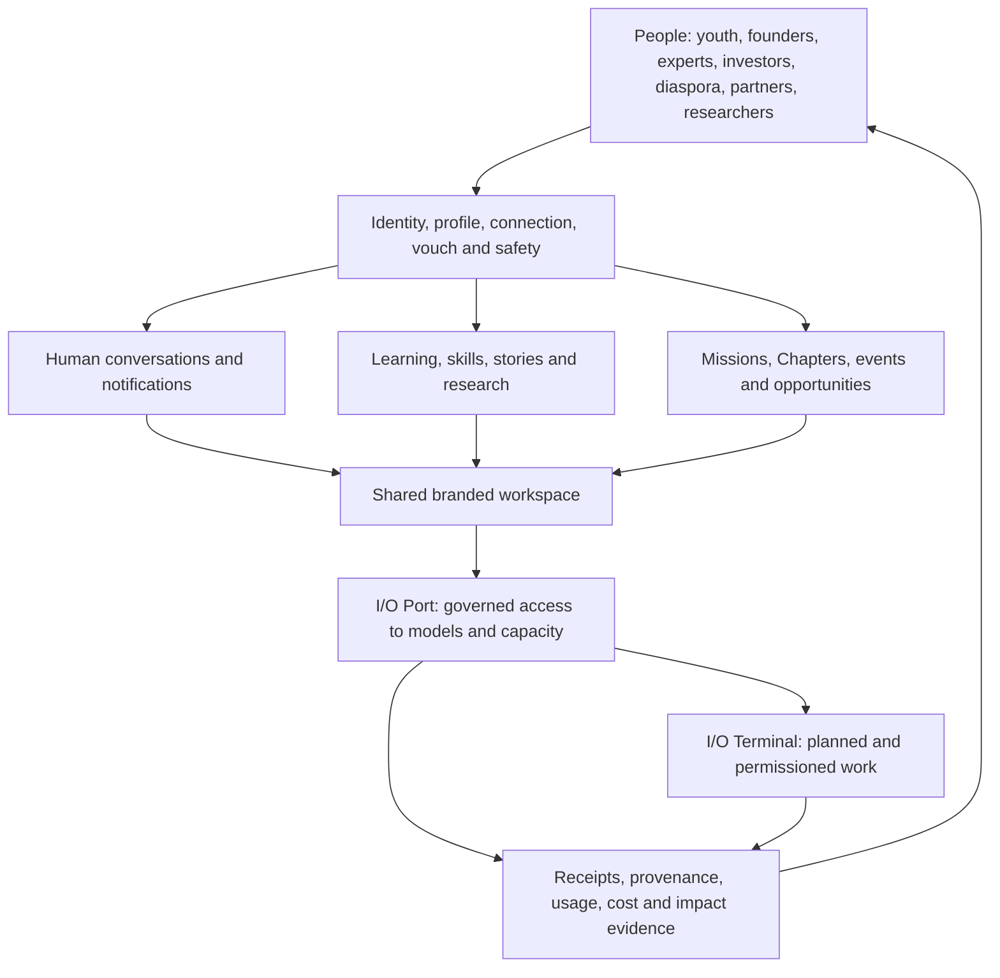

# Indus Orbit living system record

Status: canonical documentation hub, updated 2 September 2026 after the hosted operational/MFA releases and locally Verified structured collaboration increment.

This folder files the Indus Orbit product as a system: what it means, which code exists, what is operational, what remains, and how every subsystem fits the people-centred mission. Runtime source stays in its correct `src/` and `supabase/` locations; this record points to that source and distinguishes implementation from deployment.

## Read this first

1. `INDUS_ORBIT_SYSTEM.md` — product meaning, principles, actors, loops, and architecture.
2. `FULL_CODE_AUDIT_2026-08-19.md` — current two-app, data-plane and release audit with verification and remaining work.
3. `CODE_COMPLETION_REGISTER.md` — whole-product record of code done, partial, left, and release evidence.
4. `io-port-system/README.md` — current I/O Port gateway, registry, providers, pricing, safety, and next gates.
5. `io-port-system/PRODUCTION_API_COMMERCIAL_AND_PROVIDER_POLICY.md` — production addresses, key boundary, 5.5% price rule and first-provider evidence.
6. `terminal-system/README.md` — I/O Terminal/OpenCode boundary and remaining advanced terminal work.
7. `conversation-system/README.md` — current direct-message foundation and branded Discord-like spatial system.
8. `conversation-system/CHAPTER_MISSION_SPACE_SYSTEM_PLAN.md` — exact Space schema/UI delivered in code, safe hosted rollout and remaining collaboration work.
9. `admin-system/README.md` — separate admin control plane, super-admin boundary, scoped team duties and remaining domain migrations.
10. `platform-system/README.md` — the rest of the Indus Orbit platform and cross-system work.
11. `platform-system/PRODUCT_BOUNDARIES_LOCATION_AND_CONVERSION_PLAN.md` — the I/O/community identity split, optional global location and separate scientific conversion funnels.
12. `FINALIZATION_EXECUTION_PLAN.md` — the whole-product execution order, exit criteria and decisions still needed from the owner.

Product-wide delivery sequencing remains in `../MASTER_IMPLEMENTATION_AND_RELEASE_PLAN.md`; release decisions remain in `../RELEASE_READINESS_CHECKLIST.md`; database recovery and historical drift remain in `../SUPABASE_SCHEMA_RECONCILIATION.md`.

## System map

The product is not an AI router with a community attached. It is a people network in which trusted relationships, knowledge, action, and governed intelligence reinforce one another. I/O Port supplies capability; people remain the principals, beneficiaries, reviewers, and accountable decision-makers.

## Current high-level truth

| System                                | State   | Current truth                                                                                                                                                                                                                                                                                                                                                                                                                                                                                                                                                                                                                                                                                                 |
| ------------------------------------- | ------- | ------------------------------------------------------------------------------------------------------------------------------------------------------------------------------------------------------------------------------------------------------------------------------------------------------------------------------------------------------------------------------------------------------------------------------------------------------------------------------------------------------------------------------------------------------------------------------------------------------------------------------------------------------------------------------------------------------------- |
| Public site and product surfaces      | Partial | A substantial responsive site and member application exist; content truth, live data, canonical metadata, accessibility evidence, and production release discipline remain incomplete.                                                                                                                                                                                                                                                                                                                                                                                                                                                                                                                        |
| Identity, people, trust and community | Partial | One identity separates immediate `/io` access from explicitly chosen Community onboarding. Optional global country/location consent, private legacy import and consent-off measurement are Released to demo and remotely verified; browser personas and inherited trust/abuse work remain.                                                                                                                                                                                                                                                                                                                                                                                                                    |
| Administration and operations         | Partial | `admin-indus-orbit` owns the standalone admin UI. Root admins are distinct from scoped duties; provider/team/evidence/budget/circuit, Trust, Member Support, Content, Programme, Audit and Finance operations are Released. Redacted notification retry/dead-letter controls and TOTP/AAL2 two-person root changes are now Released at the database boundary and locally Verified in the app. The repository passes 27/27 tests and enforced bundle budgets. Hosting, enrolled dual-admin personas and approved external operations remain.                                                                                                                                                                   |
| Conversations                         | Partial | Durable direct messages and the Chapter/Mission Space foundation are Released. Exact-pair ephemeral typing authorization is Released without last-seen storage; a root Orbit store plus replay-safe DM outbox, reconnect reconciliation, cross-tab unread refresh and active-conversation typing are locally Verified. Boards, manager Room lifecycle, role hierarchy/explanation and saved-work aggregation are locally Verified under expand/migrate/contract fallbacks; their broad authorization migration is Blocked pending explicit owner approval. The scanner/notification lease and retry/dead boundary is Released; provider/scheduling activation and authenticated multi-device personas remain. |
| I/O Port                              | Partial | Registry/dynamic selection/`io-gateway` v27/receipts, budgets/ledger, health/circuits/cancellation, exact 5.5% fee evidence, commercial activation gate, scoped-key `io-openai` v9, multi-window request/spend limits, stateless Responses subset, HMAC safety IDs, explicit China-route policy and conformance v3 are Released. OpenAI/DeepSeek remain resale-pending; traffic is zero.                                                                                                                                                                                                                                                                                                                      |
| I/O Terminal                          | Partial | Safe durable lifecycle/approval metadata pair with a typed loopback client that consumes OpenCode global SSE, reconciles sessions, continues prompts, renders bounded task trees and full local diffs, and enforces audited approval decisions. Pinned real-daemon/browser evidence, short-lived pairing, advanced outputs/artifacts/handoffs and signed OS installers remain.                                                                                                                                                                                                                                                                                                                                |
| Data and Supabase                     | Partial | Project `jpwvgpnbkrktipwhvqss` is healthy in `ap-south-1` with 110 hosted migrations; latest are operational worker controls and admin MFA/two-person root changes. `io-gateway` v27, `io-openai` v9, conformance v3 and `orbit-attachment-scan-worker` v1 are active. The structured-Spaces migration passes dry-run but remains unapplied pending explicit approval. Retain a fresh empty-database replay for the current chain.                                                                                                                                                                                                                                                                            |
| Quality and release operations        | Partial | Member tests pass 94/94 and admin tests pass 27/27. Formatting, typecheck, zero-warning lint, production builds and enforced bundle budgets pass in both repositories. Authenticated personas, accessibility/visual/real-daemon/load evidence, field Core Web Vitals, telemetry and incident-response drills remain.                                                                                                                                                                                                                                                                                                                                                                                          |

## Evidence rules

- `Released` means deployed to the named environment and verified there.
- `Verified` means working code with stated test evidence, not necessarily deployed.
- `Partial` means useful code exists but material completion work remains.
- `Planned` means documentation or UI intent exists without operating evidence.
- A provider key is a credential, not a connection or approval.
- A provider registry row is metadata, not proof of conformance.
- A migration file is not deployed until migration history and database objects verify it.
- A UI card is not live data unless its source and failure behavior are explicit.
- A price is not current unless it has evidence, units, currency, effective time, and review ownership.

## Maintenance contract

The root `AGENTS.md` requires code and this record to change together. Every material update must:

1. update the relevant subsystem README;
2. update `CODE_COMPLETION_REGISTER.md` when completion state changes;
3. identify environment and evidence;
4. preserve the boundary between human conversation, model work, terminal events, and billing/audit records;
5. update provider/model/price sources before changing route eligibility;
6. never mark paid traffic or production readiness complete from a local test alone.
