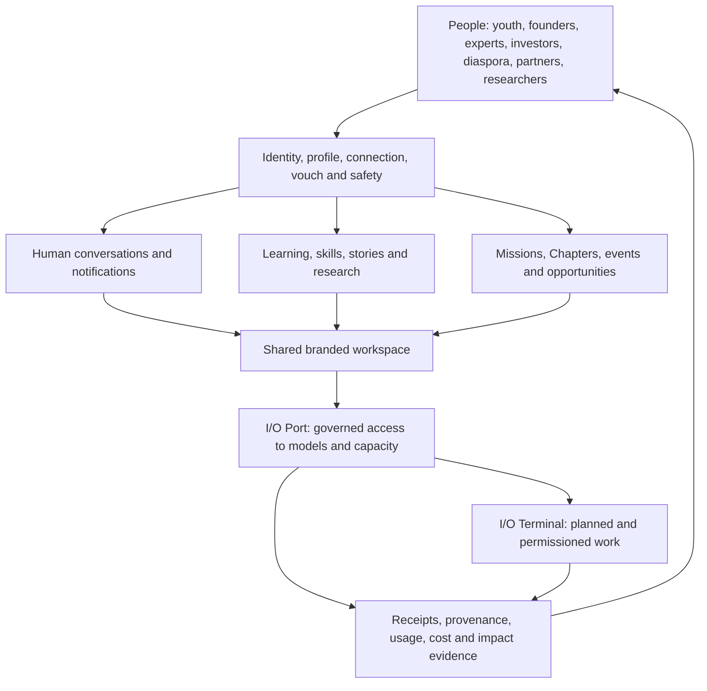

# Indus Orbit living system record

Status: canonical documentation hub, updated 9 August 2026 after the Chapter/Mission Space foundation was Released to demo.

This folder files the Indus Orbit product as a system: what it means, which code exists, what is operational, what remains, and how every subsystem fits the people-centred mission. Runtime source stays in its correct `src/` and `supabase/` locations; this record points to that source and distinguishes implementation from deployment.

## Read this first

1. `INDUS_ORBIT_SYSTEM.md` — product meaning, principles, actors, loops, and architecture.
2. `CODE_COMPLETION_REGISTER.md` — whole-product record of code done, partial, left, and release evidence.
3. `io-port-system/README.md` — current I/O Port gateway, registry, providers, pricing, safety, and next gates.
4. `terminal-system/README.md` — I/O Terminal/OpenCode boundary and remaining advanced terminal work.
5. `conversation-system/README.md` — current direct-message foundation and branded Discord-like spatial system.
6. `conversation-system/CHAPTER_MISSION_SPACE_SYSTEM_PLAN.md` — exact Space schema/UI delivered in code, safe hosted rollout and remaining collaboration work.
7. `admin-system/README.md` — separate admin control plane, super-admin boundary, scoped team duties and remaining domain migrations.
8. `platform-system/README.md` — the rest of the Indus Orbit platform and cross-system work.
9. `platform-system/PRODUCT_BOUNDARIES_LOCATION_AND_CONVERSION_PLAN.md` — the I/O/community identity split, optional global location and separate scientific conversion funnels.
10. `FINALIZATION_EXECUTION_PLAN.md` — the whole-product execution order, exit criteria and decisions still needed from the owner.

Product-wide delivery sequencing remains in `../MASTER_IMPLEMENTATION_AND_RELEASE_PLAN.md`; release decisions remain in `../RELEASE_READINESS_CHECKLIST.md`; database recovery and historical drift remain in `../SUPABASE_SCHEMA_RECONCILIATION.md`.

## System map

The product is not an AI router with a community attached. It is a people network in which trusted relationships, knowledge, action, and governed intelligence reinforce one another. I/O Port supplies capability; people remain the principals, beneficiaries, reviewers, and accountable decision-makers.

## Current high-level truth

| System                                | State                        | Current truth                                                                                                                                                                                                                                                                                                                                           |
| ------------------------------------- | ---------------------------- | ------------------------------------------------------------------------------------------------------------------------------------------------------------------------------------------------------------------------------------------------------------------------------------------------------------------------------------------------------- |
| Public site and product surfaces      | Partial                      | A substantial responsive site and member application exist; content truth, live data, canonical metadata, accessibility evidence, and production release discipline remain incomplete.                                                                                                                                                                  |
| Identity, people, trust and community | Partial                      | One identity separates immediate `/io` access from explicitly chosen Community onboarding. Optional global country/location consent, private legacy import and consent-off measurement are Released to demo and remotely verified; browser personas and inherited trust/abuse work remain.                                                              |
| Administration and operations         | Separate app foundation      | `admin-indus-orbit` now owns the standalone admin UI; database authority remains in this platform migration history. Root admins are distinguished from six scoped duties, and I/O/team operations have checked RPCs. Legacy trust/member/content/program modules still require server-bound migration.                                                 |
| Conversations                         | Partial                      | Durable direct messages and the Chapter/Mission Space foundation are Released. Hosted verification covers 19 RLS tables, expected functions, direct-write revocation, Realtime publication and a 9-Space/57-Room backfill. The first branded UI is on GitHub. Threads UI, attachments, moderation, search and the cross-product shell remain.           |
| I/O Port                              | Partial, deployed foundation | Control-plane schema, dynamic selection, gateway v17, receipts, fail-closed activation and UIs exist. The hosted registry contains five providers, models, endpoints, capability and price versions, plus three capacity sources/grants; ready traffic evidence is still zero, so each connection still requires conformance and controlled activation. |
| I/O Terminal                          | Partial proof                | A safe loopback OpenCode proof exists. Durable sessions, permissions, approvals, tools, diffs, artifacts, handoffs, recovery and hosted runners remain.                                                                                                                                                                                                 |
| Data and Supabase                     | Partial                      | Project `jpwvgpnbkrktipwhvqss` is linked, healthy and contains all 62 migrations. A clean local replay passes 433/433; the hosted Space contract and public-schema lint pass. Historical timestamp reconciliation, inherited Advisor backlog and production separation remain.                                                                          |
| Quality and release operations        | Partial                      | Typecheck, 38 unit tests, 433 database assertions and the production build pass on the current code. Hosted migration verification, browser personas, accessibility, provider conformance, telemetry, incident response and performance evidence remain.                                                                                                |

## Evidence rules

- `Released` means deployed to the named environment and verified there.
- `Verified` means working code with stated test evidence, not necessarily deployed.
- `Partial` means useful code exists but material completion work remains.
- `Planned` means documentation or UI intent exists without operating evidence.
- A provider key is a credential, not a connection or approval.
- A provider registry row is metadata, not proof of conformance.
- A migration file is not deployed until migration history and database objects verify it.
- A UI card is not live data unless its source and failure behavior are explicit.
- A price is not current unless it has evidence, units, currency, effective time, and review ownership.

## Maintenance contract

The root `AGENTS.md` requires code and this record to change together. Every material update must:

1. update the relevant subsystem README;
2. update `CODE_COMPLETION_REGISTER.md` when completion state changes;
3. identify environment and evidence;
4. preserve the boundary between human conversation, model work, terminal events, and billing/audit records;
5. update provider/model/price sources before changing route eligibility;
6. never mark paid traffic or production readiness complete from a local test alone.
