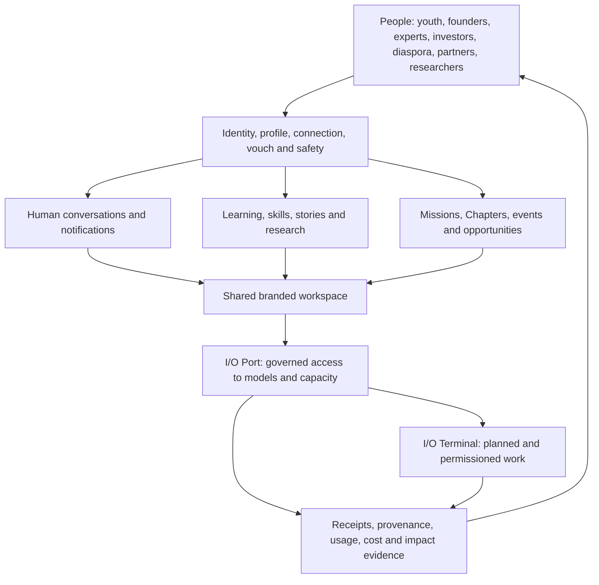

# Indus Orbit living system record

Status: canonical documentation hub, updated 10 September 2026 after the streaming execution-boundary, fail-closed transport-rollout and direct-message recovery verification.

This folder files the Indus Orbit product as a system: what it means, which code exists, what is operational, what remains, and how every subsystem fits the people-centred mission. Runtime source stays in its correct `src/` and `supabase/` locations; this record points to that source and distinguishes implementation from deployment.

## How work is tracked

This directory is the single source of truth for delivery status. Do not create a second progress folder or treat an issue list, UI preview, migration file or local source tree as proof that a capability is live.

| Question                                                | Canonical file                                     |
| ------------------------------------------------------- | -------------------------------------------------- |
| What is done, partial, left or blocked?                 | `CODE_COMPLETION_REGISTER.md`                      |
| What phase comes next, and who owns it?                 | `PHASED_COMPLETION_PLAN_2026-09-08.md`             |
| What is the complete whole-product route to production? | `FINALIZATION_EXECUTION_PLAN.md`                   |
| What did the last full code audit find?                 | `FINAL_CODE_LEVEL_AUDIT_2026-09-06.md`             |
| What is true for one subsystem?                         | The matching `*-system/README.md` and linked plans |

Every completion entry must name its state, environment and evidence. Git history records the exact delivered commit; this folder records what that commit means. Work is not marked `Released` until the intended environment is deployed and verified.

## Read this first

1. `INDUS_ORBIT_SYSTEM.md` — product meaning, principles, actors, loops, and architecture.
2. `FULL_CODE_AUDIT_2026-08-19.md` — current two-app, data-plane and release audit with verification and remaining work.
3. `CODE_COMPLETION_REGISTER.md` — whole-product record of code done, partial, left, and release evidence.
4. `io-port-system/README.md` — current I/O Port gateway, registry, providers, pricing, safety, and next gates.
5. `io-port-system/PRODUCTION_API_COMMERCIAL_AND_PROVIDER_POLICY.md` — production addresses, key boundary, 5.5% price rule and first-provider evidence.
6. `terminal-system/README.md` — I/O Terminal/OpenCode boundary and remaining advanced terminal work.
7. `conversation-system/README.md` — current direct-message foundation and branded Discord-like spatial system.
8. `conversation-system/CHAPTER_MISSION_SPACE_SYSTEM_PLAN.md` — exact Space schema/UI delivered in code, safe hosted rollout and remaining collaboration work.
9. `admin-system/README.md` — separate admin control plane, super-admin boundary, scoped team duties and remaining domain migrations.
10. `platform-system/README.md` — the rest of the Indus Orbit platform and cross-system work.
11. `platform-system/PRODUCT_BOUNDARIES_LOCATION_AND_CONVERSION_PLAN.md` — the I/O/community identity split, optional global location and separate scientific conversion funnels.
12. `FINALIZATION_EXECUTION_PLAN.md` — the whole-product execution order, exit criteria and decisions still needed from the owner.
13. `PHASED_COMPLETION_PLAN_2026-09-08.md` — the current phase-by-phase code, verification, owner-input and external-work handoff.
14. `io-port-system/NINEROUTER_SELECTIVE_ADOPTION.md` — exact 9router source selection, rejection matrix, architecture and rollout gates.

Product-wide delivery sequencing remains in `../MASTER_IMPLEMENTATION_AND_RELEASE_PLAN.md`; release decisions remain in `../RELEASE_READINESS_CHECKLIST.md`; database recovery and historical drift remain in `../SUPABASE_SCHEMA_RECONCILIATION.md`.

## System map

The product is not an AI router with a community attached. It is a people network in which trusted relationships, knowledge, action, and governed intelligence reinforce one another. I/O Port supplies capability; people remain the principals, beneficiaries, reviewers, and accountable decision-makers.

## Current high-level truth

| System                                | State   | Current truth                                                                                                                                                                                                                                                                                                                                                                                                                                                                                                                                                                                                                                                |
| ------------------------------------- | ------- | ------------------------------------------------------------------------------------------------------------------------------------------------------------------------------------------------------------------------------------------------------------------------------------------------------------------------------------------------------------------------------------------------------------------------------------------------------------------------------------------------------------------------------------------------------------------------------------------------------------------------------------------------------------ |
| Public site and product surfaces      | Partial | A substantial responsive site and member application exist; content truth, live data, canonical metadata, accessibility evidence, and production release discipline remain incomplete.                                                                                                                                                                                                                                                                                                                                                                                                                                                                       |
| Identity, people, trust and community | Partial | One identity separates immediate `/io` access from explicitly chosen Community onboarding. Optional global country/location consent, private legacy import and consent-off measurement are Released to demo and remotely verified; browser personas and inherited trust/abuse work remain.                                                                                                                                                                                                                                                                                                                                                                   |
| Administration and operations         | Partial | `admin-indus-orbit` owns the standalone admin UI. Root admins are distinct from scoped duties; provider/team/evidence/budget/circuit, Trust, Member Support, Content, Programme, Audit and Finance operations are Released. Redacted notification retry/dead-letter controls and TOTP/AAL2 two-person root changes are Released. Member Support now includes a privacy-minimised export/deletion request queue whose browser operators cannot mark an export ready or execute a purge. Hosting, enrolled dual-admin personas and approved external operations remain.                                                                                        |
| Conversations                         | Partial | Durable direct messages and the Chapter/Mission Space foundation are Released. Exact-pair ephemeral typing authorization is Released without last-seen storage; a root Orbit store plus replay-safe DM outbox, reconnect reconciliation, cross-tab unread refresh and active-conversation typing are locally Verified. Migration 113 adds manager-only source-aware remove/restore, bounded Space timeouts and burst/hourly/repeated-message enforcement. Boards, Room lifecycle, role explanation and saved work remain locally Verified behind the unapplied structured-Spaces migration. External workers and authenticated multi-device personas remain. |
| I/O Port                              | Partial | Registry/dynamic selection/`io-gateway` v28/receipts, budgets/ledger, health/circuits/cancellation, exact 5.5% fee evidence, commercial activation gate, scoped-key `io-openai` v12, multi-window request/spend limits, direct upstream Chat/Responses SSE with terminal settlement, HMAC safety IDs, explicit China-route policy and conformance v3 are Released. Migration 111 and `io-health-probe` v1 add service-only non-billable probes, automatic circuit opening/recovery and a redacted incident trail. OpenAI/DeepSeek remain resale-pending; traffic is zero.                                                                                    |
| I/O Terminal                          | Partial | Safe durable lifecycle/approval metadata pair with a typed loopback client that consumes OpenCode global SSE, reconciles sessions, continues prompts, renders bounded task trees and full local diffs, and enforces audited approval decisions. Pinned real-daemon/browser evidence, short-lived pairing, advanced outputs/artifacts/handoffs and signed OS installers remain.                                                                                                                                                                                                                                                                               |
| Data and Supabase                     | Partial | Project `jpwvgpnbkrktipwhvqss` is healthy in `ap-south-1` with 114 hosted migrations. Member privacy requests and Space timeout/remove/restore/spam controls are active. Actual export generation/deletion remain unavailable until data-inventory and retention approval. `io-gateway` v28, `io-openai` v12, conformance v3, scanner worker v1 and health probe v1 are active. The structured-Spaces migration remains unapplied pending explicit approval.                                                                                                                                                                                                 |
| Quality and release operations        | Partial | The current member gate passes formatting, repository-wide lint, typecheck, all three package builds, 159/159 unit contracts, production build/bundle budgets and 6/6 public desktop/mobile Playwright journeys. The last independently verified admin baseline passes 32/32 contracts and 4/4 public Playwright journeys. Serious/critical automated accessibility, four visual baselines and a bounded 200-request production-preview load smoke exist. Authenticated multi-persona, real-daemon/soak, field Core Web Vitals, manual accessibility, telemetry and incident-response drills remain.                                                         |

## Evidence rules

- `Released` means deployed to the named environment and verified there.
- `Verified` means working code with stated test evidence, not necessarily deployed.
- `Partial` means useful code exists but material completion work remains.
- `Planned` means documentation or UI intent exists without operating evidence.
- A provider key is a credential, not a connection or approval.
- A provider registry row is metadata, not proof of conformance.
- A migration file is not deployed until migration history and database objects verify it.
- A UI card is not live data unless its source and failure behavior are explicit.
- A price is not current unless it has evidence, units, currency, effective time, and review ownership.

## Maintenance contract

The root `AGENTS.md` requires code and this record to change together. Every material update must:

1. update the relevant subsystem README;
2. update `CODE_COMPLETION_REGISTER.md` when completion state changes;
3. identify environment and evidence;
4. preserve the boundary between human conversation, model work, terminal events, and billing/audit records;
5. update provider/model/price sources before changing route eligibility;
6. never mark paid traffic or production readiness complete from a local test alone.

## Current checkpoint

- The selective 9router transport primitives remain isolated below the existing I/O policy, budget, billing and receipt control plane.
- The streaming execution adapter is locally Verified at its package boundary; no provider credential is accepted from browser code and no live provider route was changed.
- Adapter/translator versions are now filed into route and receipt evidence. Candidate comparison is exact-scoped, non-billable, content-free and disabled by default.
- Direct-message pending sends survive same-tab reload safely and are cleared across real sign-out or account changes.
- This checkpoint changes no hosted migration, Supabase row, Edge Function deployment, provider activation, payment or customer charge.
- Remaining production and owner work is filed in `CODE_COMPLETION_REGISTER.md` and sequenced in `PHASED_COMPLETION_PLAN_2026-09-08.md`.
