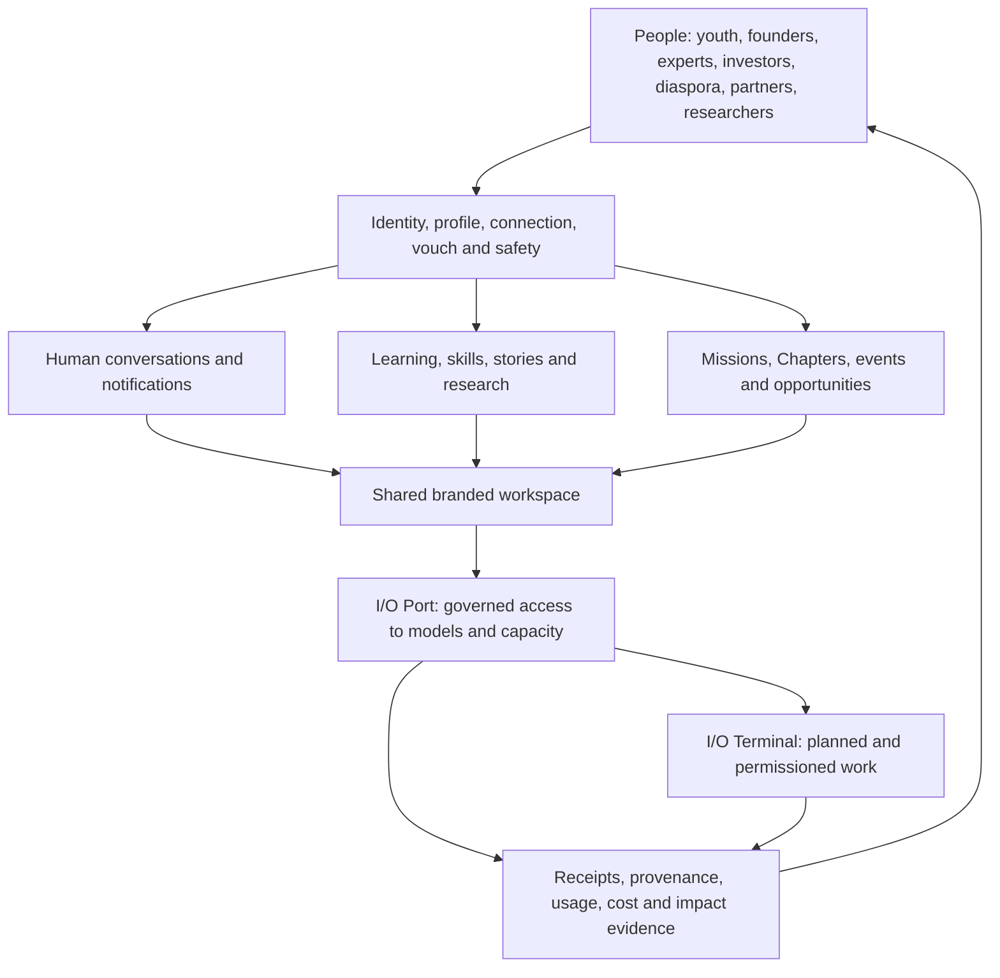

# Indus Orbit living system record

Status: canonical documentation hub, established 1 August 2026.

This folder files the Indus Orbit product as a system: what it means, which code exists, what is operational, what remains, and how every subsystem fits the people-centred mission. Runtime source stays in its correct `src/` and `supabase/` locations; this record points to that source and distinguishes implementation from deployment.

## Read this first

1. `INDUS_ORBIT_SYSTEM.md` — product meaning, principles, actors, loops, and architecture.
2. `CODE_COMPLETION_REGISTER.md` — whole-product record of code done, partial, left, and release evidence.
3. `io-port-system/README.md` — current I/O Port gateway, registry, providers, pricing, safety, and next gates.
4. `terminal-system/README.md` — I/O Terminal/OpenCode boundary and remaining advanced terminal work.
5. `conversation-system/README.md` — current direct-message foundation and branded Discord-like spatial system.
6. `platform-system/README.md` — the rest of the Indus Orbit platform and cross-system work.

Product-wide delivery sequencing remains in `../MASTER_IMPLEMENTATION_AND_RELEASE_PLAN.md`; release decisions remain in `../RELEASE_READINESS_CHECKLIST.md`; database recovery and historical drift remain in `../SUPABASE_SCHEMA_RECONCILIATION.md`.

## System map

The product is not an AI router with a community attached. It is a people network in which trusted relationships, knowledge, action, and governed intelligence reinforce one another. I/O Port supplies capability; people remain the principals, beneficiaries, reviewers, and accountable decision-makers.

## Current high-level truth

| System                                | State                        | Current truth                                                                                                                                                                                                                            |
| ------------------------------------- | ---------------------------- | ---------------------------------------------------------------------------------------------------------------------------------------------------------------------------------------------------------------------------------------- |
| Public site and product surfaces      | Partial                      | A substantial responsive site and member application exist; content truth, live data, canonical metadata, accessibility evidence, and production release discipline remain incomplete.                                                   |
| Identity, people, trust and community | Partial                      | Auth, onboarding, profiles, directory, connections, vouch, mentorship, missions, Chapters, learning, events and admin surfaces exist; several critical mutations and abuse controls still need authoritative server contracts and tests. |
| Conversations                         | Partial                      | Durable direct messages, notifications, shared hooks, hardened demo RLS, and realtime reconciliation exist; common store, cursor paging, RPC sends, private Broadcast, group collaboration, and the shared spatial shell remain.         |
| I/O Port                              | Partial, deployed foundation | The control plane, five-provider staged registry, dynamic selection, gateway v17, route receipts and UI exist. All five direct providers are deliberately non-routable until paid conformance is approved and recorded.                  |
| I/O Terminal                          | Partial proof                | A safe loopback OpenCode proof exists. Durable sessions, permissions, approvals, tools, diffs, artifacts, handoffs, recovery and hosted runners remain.                                                                                  |
| Data and Supabase                     | Partial                      | The active demo project and new I/O migrations are live. Historical drift, old security-advisor findings, full authorization suites and production environment separation remain.                                                        |
| Quality and release operations        | Partial                      | Build, typecheck, unit tests, lint and a GitHub quality workflow exist. Full browser/database/provider tests, telemetry, incident response, protected delivery, performance budgets and production evidence remain.                      |

## Evidence rules

- `Released` means deployed to the named environment and verified there.
- `Verified` means working code with stated test evidence, not necessarily deployed.
- `Partial` means useful code exists but material completion work remains.
- `Planned` means documentation or UI intent exists without operating evidence.
- A provider key is a credential, not a connection or approval.
- A provider registry row is metadata, not proof of conformance.
- A migration file is not deployed until migration history and database objects verify it.
- A UI card is not live data unless its source and failure behavior are explicit.
- A price is not current unless it has evidence, units, currency, effective time, and review ownership.

## Maintenance contract

The root `AGENTS.md` requires code and this record to change together. Every material update must:

1. update the relevant subsystem README;
2. update `CODE_COMPLETION_REGISTER.md` when completion state changes;
3. identify environment and evidence;
4. preserve the boundary between human conversation, model work, terminal events, and billing/audit records;
5. update provider/model/price sources before changing route eligibility;
6. never mark paid traffic or production readiness complete from a local test alone.
