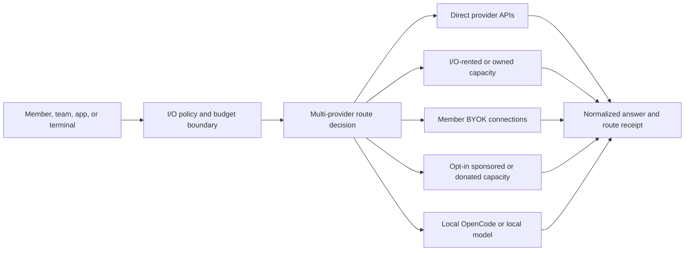

# I/O Port implementation status and multi-provider readiness

Status: local code, UI, database, admin and hosted-release assessment, updated 26 August 2026 after the terminal protocol hardening.

This is the operational source of truth for the current I/O Port implementation. It separates what exists from what is only represented in a plan or preview. Cross-product dependencies and release gates are governed by `../../MASTER_IMPLEMENTATION_AND_RELEASE_PLAN.md` and `../../RELEASE_READINESS_CHECKLIST.md`. Product direction remains in `IO_PORT_IMPLEMENTATION_PLAN.md`; the detailed delivery sequence remains in `IO_PORT_CODE_LEVEL_ROADMAP.md`; the OpenRouter comparison is in `OPENROUTER_CAPABILITY_AND_CAPACITY_PLAN.md`.

## 1. Executive verdict

I/O Port is **not operationally routing external provider traffic yet**. Its first multi-provider registry, resolver, gateway and redacted evidence plane are Released to the demo project. The hosted registry contains five providers/models/endpoints/capability/price/runtime-control/connection records and three capacity sources/grants. The last hosted verification found zero route receipts and provider attempts; inventory and configured secret names do not establish conformance or activation.

`20260801152819_enforce_latest_endpoint_conformance.sql` is Released: it binds each conformance result to a capability version from the same endpoint and makes the latest capability plus latest conformance run the shared rule for operator snapshot, activation and runtime resolution. The resolver must still not be treated as activation-grade until reviewed inventory exists and one endpoint passes conformance, budget and explicit spend gates.

The deployed gateway resolves approved registry connections through a service-role-only resolver, allows only approved `IO_PROVIDER_*_API_KEY` secret references, evaluates entitled candidates across providers, supports provider-aware OpenAI-compatible and Gemini-native request adapters, performs bounded fallback for safe upstream failures, and writes redacted receipts/attempts. The browser can request latest-affordable, lowest-cost or an approved explicit model and display RLS-scoped receipt history.

The activation-grade control-plane slice is **Released to the hosted demo**. Migration `20260810002754_create_io_operational_core.sql` and gateway v27 provide fingerprinted idempotency, hard budget reservation before dispatch, balanced settlement/release, health/circuits, bounded validated provider responses and client-to-provider cancellation. Gateway v27 uses one route transaction for the browser and `io-openai` v9. The terminal migrations add creator-only safe metadata and non-executable approval RPCs. Hosted release contracts pass; provider routing is still disabled.

The bounded OpenAI-compatible API foundation is also Released. Migration `20260819232624_add_io_openai_api_foundation.sql`, the member key-management UI and `io-openai` v9 provide one-time 30-day keys, SHA-256-only storage, scopes/revocation, membership revalidation, immutable multi-window request and spend limits, browser-origin persistent-key rejection, entitlement-filtered `/v1/models`, Chat JSON/SSE, a stateless `/v1/responses` subset and provider-fetch cancellation. Function tools, strict JSON output and HTTPS image input are capability gated. See `OPENAI_COMPATIBLE_API_STATUS.md`. This is a usable compatibility subset, not the complete OpenRouter capability set.

Migrations `20260820001339_add_io_transparent_service_fee.sql` and `20260820023501_add_io_commercial_fk_indexes.sql` are Released. They add an exact versioned 5.5% fee, high-precision provider-cost/fee/customer-total evidence, atomic priced finalization, written onward-access provider states and a shared fail-closed commercial gate. OpenAI and DeepSeek are explicitly `resale_pending`, so neither can route. The separate admin app displays commercial state and evidence. See `PRODUCTION_API_COMMERCIAL_AND_PROVIDER_POLICY.md`.

Hosted migrations `20260820191501`, `20260820191544` and `20260820191815` release the workspace China-processing policy, conservative key limits, atomic per-key spend reservations, single-use 30-minute/USD 0.01 provider-conformance approval, redacted evidence and covering audit indexes. `io-provider-conformance` v3 is active, but no approval or provider call has been created. The public admin source is separately published to the private `admin-indus-orbit` repository.

Provider API keys by themselves do not make a provider routable. The verified deployed cohort counts are:

| Deployed record                        | Count |
| -------------------------------------- | ----: |
| staged direct `io_providers`           |     5 |
| staged `io_models`                     |     5 |
| staged `io_model_endpoints`            |     5 |
| draft capability versions              |     5 |
| published evidence-backed price cards  |     5 |
| testing endpoint connections           |     5 |
| runtime controls                       |     5 |
| `private.io_provider_conformance_runs` |     0 |
| ready resolver results                 |     0 |
| `io_route_receipts`                    |     0 |
| `io_provider_attempts`                 |     0 |
| capacity sources                       |     3 |
| workspace capacity grants              |     3 |

The demo deployment contains metadata and secret references, not key values. No provider completion or billable conformance call was made. The remaining critical work is written onward-access approval, trusted provider conformance, one deliberately bounded live test, individual activation, scheduled health/operations and direct/rented/donated capacity partnerships. Billing is no longer only a draft snapshot: the hosted schema now has verified buyer identity, second-person tax/FX/payment policies, immutable issuance, payment/refund evidence, provider reconciliation and member PDF rendering. The reviewed payment functions are deployed, but these paths remain inactive until policy owners approve them; approved processor/tax-policy counts are zero and checkout fails closed.

### 1.1 Trust and finance release, 24 August 2026

- Separate admin routes now exist for report triage, attachment review, appeals and billing/finance.
- Members have a Safety & Appeals route and can submit one bounded appeal before the recorded deadline.
- Attachment scanner callbacks are HMAC-authenticated, idempotent and store normalized evidence rather than raw payloads. Humans cannot mark an attachment clean.
- Billing profiles use optimistic versioning; changing legal/tax identity clears verification.
- Tax, GST and FX are versioned evidence with effective dates and second-person approval; application code never invents a rate or place of supply.
- Invoice issuance freezes seller, buyer and tax evidence and uses exact integer nanos plus explicit currency-minor-unit rounding.
- Issued invoices can be downloaded by workspace members as a PDF derived from the immutable database representation; drafts cannot be represented as tax invoices.
- Checkout receives only a public Razorpay key and a server-created order. Capture, failure, dispute and refund status remain signed-webhook authoritative.
- Provider statements reconcile immutable line evidence to route attempts by provider request ID, retaining unmatched, ambiguous, currency and amount exceptions.
- The finance runtime stays fail-closed: zero approved tax policies, FX rates and live processors. `io-payments` v3 and `io-payment-webhook` v2 are deployed, but no valid payment path exists until credentials and two-person-approved policy records are present; no charge was attempted.

### 1.2 Authenticated browser and member-read repair, 24 August 2026

- A signed-in production-browser audit verified that Overview, Sessions, Terminal, Model routes, Capacity, Evidence, Usage ledger and Safety resolve to distinct `?view=` states with distinct working-surface headings. The active route survives refresh and the previous low-contrast workspace surface is no longer present.
- Migration `20260824223000_fix_io_member_history_and_key_listing.sql` repairs the member usage-history query by giving joined usage totals unique internal aliases before constructing receipt JSON. This removes the hosted PostgreSQL `provider_cost_nanos is ambiguous` failure without changing the public response contract.
- API-key listing now uses `list_my_io_api_keys(uuid)`, a caller-bound `SECURITY DEFINER` RPC that rechecks active workspace membership and returns only browser-safe metadata. The browser does not receive a raw key, key hash or a base-table grant.
- The hosted migration and function ACLs are verified. The local member client and generated TypeScript contract use the new RPC; the web change still requires the normal GitHub-to-Netlify production deployment before the old bundle stops issuing its historical view request.

## 2. What “I/O Port” must mean

A port is not one provider hidden behind one endpoint. It is a governed exchange with multiple possible capacity sources:



The member must be able to understand which model, provider, serving region, data policy, capacity class, price card, and fallback rule applied. “Latest and affordable” is one selection strategy inside this larger policy boundary; it is not the whole router.

## 3. Implemented and verified

### 3.1 Product and UI foundation

- Public `/io-port` accurately describes the gateway and control room as private beta and the terminal as next. It does not claim that providers or public capacity are live.
- Authenticated top-level `/io` has its own branded product shell and accepts any signed-in Indus Orbit identity without Community onboarding, location, vouch or verification. `/app/io` redirects before the Community gate.
- The Community switch opens `/app`; a nonmember sees an explicit I/O-versus-Community choice and setup starts only after a deliberate Community action.
- The working overview can create/select a workspace, display entitled capacity sources and safe audit events, select Observe/Plan/Build/Run, and choose between local OpenCode and a provider-partnership path.
- The provider path calls a safe catalogue action and presents `Latest + affordable`, `Lowest cost`, and an explicit reviewed-model selector. It remains disabled until the gateway returns an entitled reviewed route.
- The nested I/O shell now uses eight distinct query-backed views rather than in-page hash jumps. Overview, Sessions, Terminal, Model routes, Capacity, Evidence, Usage ledger and Safety each have an active navigation state, survive refresh and fail safely to Overview for invalid search input. The light workspace establishes its own foreground/design-token scope so headings, inputs, placeholders and ghost controls no longer inherit the outer parchment text colour. The view registry and fallback are covered by the 59-test member suite; authenticated visual/accessibility personas remain required.
- The route-evidence ledger shows the latest twelve RLS-scoped receipts with provider/model, route strategy, capacity/residency, attempts, failures/fallbacks, token use and currency-labelled estimate. It stores and renders no prompt or response body.
- The member surface now loads authoritative budget status, disables partner dispatch when no usable budget is available, displays settled/released minor units after a route, and lists durable local-terminal lifecycle records.

### 3.2 Supabase control plane

- RLS-protected workspaces, memberships, projects, environments, capacity sources, workspace grants, route-policy records, API-key metadata, and append-only audit-event foundations exist.
- Personal workspace creation is an authenticated atomic RPC instead of a browser-controlled multi-table write.
- Capacity provenance distinguishes local/owned, partner, and sponsored sources.
- Provider, model, endpoint, versioned capability, and versioned pricing tables exist.
- Endpoint connection details and conformance runs are kept in the private schema rather than exposed through the browser Data API.
- The dynamic-model migration adds reviewed release dates and `economy`/`balanced`/`premium` automatic-route tiers.
- A private provider runtime-control table and append-only control-event table are deployed. Five provider runtime controls and five endpoint connections currently exist.
- The separate `admin-indus-orbit` application has a capability-checked I/O readiness/control room. The browser receives lifecycle and conformance states but no credential value, prompt or generated content.
- `20260809174030_create_admin_io_evidence_rpcs.sql` is Released. It adds capability-checked aggregate evidence and keyset-paginated redacted receipt RPCs, a global receipt-time index and currency evidence on receipts. Anonymous execution is revoked and regular members fail closed.
- The admin application consumes those RPCs to show readiness, capacity/grant, route/attempt, token and currency-separated estimated-cost evidence plus older-receipt pagination. It does not receive workspace/user IDs, prompts, outputs, credentials, endpoint URLs or raw provider errors.
- Local Verified migration source now rejects a historical passing run after any newer failed/running/cancelled run, rejects a pass for an older capability version, enforces same-endpoint capability references, and prevents an eligible endpoint from making an ineligible sibling routable.
- `20260810002754_create_io_operational_core.sql` is locally Verified. It adds budget versions, reservations, usage records, private idempotency and balanced ledger records, endpoint health/circuit records, reserve/finalize/outcome RPCs and capability-checked member/admin status/mutation RPCs.
- The separate admin app consumes the new RPCs to create immutable workspace budget versions and manually open or close an endpoint circuit with an operator reason. Route visibility remains presentation only; every read/write is capability checked in the database.

### 3.3 Gateway foundation

- Active `io-gateway` version 20 verifies a user token, active workspace membership, active capacity entitlement, request shape, message limits, and CORS origin.
- Provider credentials remain server-side.
- Requests and outcomes write redacted audit metadata without prompt or response text.
- The selector fails closed unless an entitled provider, model, endpoint, verified chat capability, active capacity source, and effective member-visible price card are eligible.
- It supports `latest_affordable`, `lowest_cost`, and an explicit reviewed model. Automatic selection has a configurable tier, freshness window and affordability band; mixed currencies fail closed until reviewed FX conversion exists.
- An approved connection can resolve only an allowlisted `IO_PROVIDER_*_API_KEY` secret name. The browser receives neither endpoint URL nor credential.
- The adapter normalizes non-streaming OpenAI-compatible Chat Completions and Gemini native `generateContent`; local audited code streams successful bodies through a 2 MiB cap, requires valid JSON, validates shapes and normalizes token use and a safe request ID. Provider error bodies are not parsed or returned.
- Dispatch defaults to one provider attempt. Operator-enabled fallback is capped at three through `IO_PROVIDER_MAX_ATTEMPTS` and remains unsuitable for paid traffic until idempotency, reservation and policy controls exist.
- The deployed forward-only migrations introduce append-only `io_route_receipts` and `io_provider_attempts`. They exclude prompts, generated text, credentials, headers and raw upstream errors; selected currency is retained for valid aggregation.
- A follow-up migration covers every receipt/attempt provider, model, endpoint and capacity foreign key used for operator history and reconciliation; the Performance Advisor reports no remaining unindexed foreign key in the new I/O evidence tables.
- `20260809182509_add_io_conformance_composite_index.sql` additionally covers the private endpoint/capability conformance relationship; the hosted migration record and index are independently verified.
- The locally Verified gateway now requires an idempotency key, computes a stable request fingerprint, reserves the conservative summed worst-case cost across all allowed attempts before dispatch, records every endpoint outcome, atomically settles actual use or releases the reservation and returns settled/released minor units plus cost-basis evidence.
- Fallback finalization records the endpoint actually used. Duplicate keys with a different request fail closed; completed keys return replay-safe stored results; stale open reservations expire into balanced release ledger entries.
- When a provider returns complete token usage, settlement uses it. Otherwise the receipt explicitly labels the conservative byte-based estimate; it never presents an estimate as provider-billed truth.

### 3.4 Local terminal and conversation foundation

- The browser can connect only to a credential-free root loopback OpenCode origin over HTTP; paths, query strings, fragments and embedded URL credentials are rejected, while an optional OpenCode password is held in memory.
- The proof validates OpenCode health/session/message objects, encodes the session ID, performs bounded prompt delivery, and reports safe-audit failure separately. Calls support cancellation, default to 45 seconds and cap response data at 1 MiB.
- `20260810010415_create_io_terminal_session_foundation.sql` is locally Verified. It adds creator-only sessions, members, events and approval foundations plus caller-bound create/complete/list RPCs.
- `20260812000100_add_io_terminal_timeline_and_approval_rpcs.sql` is locally Verified. It adds ordered replay-safe metadata timeline RPCs plus bounded approval request and owner-decision RPCs that cannot execute a command.
- Runtime origin and OpenCode session references are stored only as SHA-256 hashes. Prompt, output, code, commands, file paths and password remain outside Supabase. The connector records created/completed/failed/stopped lifecycle and safe runtime/prompt metadata events. Browser Stop is recorded as stopped only after the daemon positively acknowledges `/abort`; otherwise the durable state is failed and the member must reconnect.
- Existing direct messages remain the human conversation source. I/O prompts and terminal work are not inserted into `direct_messages`.
- Direct-message RLS/read permissions were hardened. Both message surfaces reuse shared hooks, event-driven unread reconciliation and a Verified caller-bound 50-row keyset history RPC; migration 68 still needs hosted release.

### 3.5 Repository verification

| Check                                  | Result          | Interpretation                                                                                                                                                                                                                                                                                                                                    |
| -------------------------------------- | --------------- | ------------------------------------------------------------------------------------------------------------------------------------------------------------------------------------------------------------------------------------------------------------------------------------------------------------------------------------------------- |
| `npm run build`                        | Pass            | The current web application produces a production bundle.                                                                                                                                                                                                                                                                                         |
| `npm run typecheck`                    | Pass            | Current browser/server TypeScript compiles.                                                                                                                                                                                                                                                                                                       |
| `npm run format:check`                 | Pass            | Mechanical formatting drift has been removed.                                                                                                                                                                                                                                                                                                     |
| `npm run test:unit`                    | Pass — 85/85    | Auth/product/location, conversations/Orbit feed/attention/person-role-mention/permission/quiet-policy/search controls, API-key usage/rotation, terminal permission/credential policy, packaged OpenCode capability/SSE/tasks/diffs/tools/fork/abort/revert/permissions, gateway protocols/adapters/routing and fixed email templates are covered. |
| `npm run audit:high`                   | Pass            | No critical, high or moderate dependency advisory remains.                                                                                                                                                                                                                                                                                        |
| I/O-focused ESLint run                 | Pass            | `src/features/io` and I/O routes pass current lint rules.                                                                                                                                                                                                                                                                                         |
| Repository-wide `npm run lint --quiet` | Pass — 0 errors | The local semantic lint gate now passes across the repository.                                                                                                                                                                                                                                                                                    |
| Automated gateway/router unit tests    | Pass            | Validation, idempotency/budget-operation decoding, selection/attempt bounds and provider request/error fixtures pass.                                                                                                                                                                                                                             |
| Empty Supabase migration replay        | 68/68 pass      | Every checked-in migration replays from zero on the local stack.                                                                                                                                                                                                                                                                                  |
| Database provider/ACL/schema contracts | 550/550 pass    | Includes 46 operational-core, 49 terminal-foundation and nine direct-history pagination assertions.                                                                                                                                                                                                                                               |
| Supabase schema lint                   | Pass            | The local `public` and `private` schemas report no lint errors.                                                                                                                                                                                                                                                                                   |
| Hosted Space release contract          | Pass            | No missing migration/table/function; 19/19 Space tables use RLS; direct protected writes are false; Realtime publication is true.                                                                                                                                                                                                                 |
| Hosted public generated types          | Synchronized    | Checked-in TypeScript contracts were regenerated from hosted project `jpwvgpnbkrktipwhvqss` after migration 73.                                                                                                                                                                                                                                   |
| Provider conformance tests             | None recorded   | No provider is operationally certified.                                                                                                                                                                                                                                                                                                           |
| Hosted migrations/functions            | Released        | `io-gateway` v27, `io-openai` v9 and `io-provider-conformance` v3 enforce their custom authentication and browser-origin boundaries.                                                                                                                                                                                                              |

## 4. Implemented, but requires improvement

| Area                      | What exists                                                                                                                                                                                                                                                                                                            | Why it is insufficient                                                                                                                                                   | Required improvement                                                                                                                   |
| ------------------------- | ---------------------------------------------------------------------------------------------------------------------------------------------------------------------------------------------------------------------------------------------------------------------------------------------------------------------- | ------------------------------------------------------------------------------------------------------------------------------------------------------------------------ | -------------------------------------------------------------------------------------------------------------------------------------- |
| Provider connection       | Five deployed private connection records use distinct provider-specific secret references; an audited/capped conformance workflow is Released                                                                                                                                                                          | All remain testing and no conformance result exists                                                                                                                      | Verify secrets/terms, explicitly execute one approved run, then activate one authorized connection at a time                           |
| Dynamic model selection   | Local source compares entitled, priced, healthy, non-open-circuit candidates across connections                                                                                                                                                                                                                        | It does not yet apply formal route-policy snapshots, recent-latency scoring, FX, cached pricing or the complete member policy                                            | Add hard policy filters and versioned scoring inputs before activation                                                                 |
| Provider registry         | Sound public/private schema split with five provider/model/endpoint/price/connection records                                                                                                                                                                                                                           | Records remain unproven until secret references, evidence and conformance are reviewed                                                                                   | Add operator onboarding, evidence refresh, deprecation and lifecycle workflows                                                         |
| Provider adapter          | Released shared adapter has bounded OpenAI-compatible tool calls/results, strict structured output and HTTPS vision input plus Gemini-native text; the resolver consumes exact verified capability flags. Client cancellation propagation is Released.                                                                 | SSE is post-settlement rather than direct upstream; no audio/files or passing advanced conformance evidence                                                              | Conform and activate each capability separately, then add direct token streaming                                                       |
| Request validation        | Strict request and normalized response validation                                                                                                                                                                                                                                                                      | Streaming frames and provider-specific error schemas are not versioned                                                                                                   | Add schemas and contract tests for each supported feature                                                                              |
| Reliability               | Released code requires idempotency, reserves retry cost, samples outcomes and excludes open circuits; timeout/rate-limit classification, bounded attempt cap and cancellation propagation are active                                                                                                                   | No scheduled probes, latency/queue scoring, automated half-open recovery or distributed rate-limit layer                                                                 | Add those controls before broad traffic                                                                                                |
| Audit                     | Immutable receipts/attempts, capability-checked evidence and provider-statement reconciliation are Released; route finalization binds reservation, usage and ledger atomically                                                                                                                                         | No conformance route has exercised the hosted path; exact route-policy/registry/price/health snapshot binding and live reconciliation evidence remain                    | With spend approval, verify one bounded route and reconcile its complete evidence chain                                                |
| Cost and budget           | Released integer-unit reserve/settle/release, exact 5.5% evidence, automatic non-cash credit application, caller-bound usage history, buyer profiles, versioned GST/tax and FX evidence, immutable issuance, payment/refund state and reconciliation                                                                   | Cached input, tools/media and provider-specific units remain; live tax/processor policies are intentionally unapproved and controlled concurrency has not been exercised | Concurrency-test controlled traffic, approve the commercial policies, then run sandbox issuance/payment/refund/reconciliation journeys |
| Capacity truth            | Three labelled demo sources and grants                                                                                                                                                                                                                                                                                 | The generic partner/sponsored demo records currently carry `IN` region/residency metadata without provider-specific evidence                                             | Change unknown facts to unknown; attach India claims only to a certified endpoint and evidence version                                 |
| Auth runtime              | JWT check with legacy anon/service-role environment variables                                                                                                                                                                                                                                                          | It works, but newer publishable/secret key rotation and narrower privileged access should be planned                                                                     | Move to current Supabase key conventions and keep admin client use inside the smallest possible functions                              |
| Web control room          | Workspace, terminal, route/model selection and preflight, real budget state, paged/filterable usage, exact fee/credit/due evidence, credit/invoice summaries/downloads, durable terminal history, capacity and safe audit                                                                                              | The current member build is not hosted; detailed health and authenticated live payment/reconciliation journeys are absent                                                | Deploy and verify the member build, then add approved health and commercial operations                                                 |
| Local OpenCode            | Typed packaged loopback client, memory-only strong password, OpenAPI capability negotiation, `/global/event` SSE plus REST reconciliation, continued prompts, local forks, task tree/todos, bounded local tool/command trail, complete diffs, acknowledged abort/revert and hosted-audit-before-exact permission reply | Needs pinned real-daemon browser personas, Observe/Plan policy profiles, step-up, artifacts/handoff, short-lived pairing and signed OS installers                        | Complete the production pairing/installer, policy and real-daemon verification boundary                                                |
| Conversation client       | Shared hooks, better DM RLS and locally Verified caller-bound keyset history                                                                                                                                                                                                                                           | Migration 68 is not hosted; hook instances are separate and no common store/private Broadcast exists                                                                     | Release migration 68, then complete the shared store/realtime plan before group collaboration                                          |
| Operational documentation | Plans and provider inventory exist                                                                                                                                                                                                                                                                                     | Earlier secret guidance could be read as multi-provider activation, which is incorrect                                                                                   | Treat this document and the corrected operating guide as the current source of truth                                                   |

## 5. Remaining implementation boundary

### 5.1 Multi-provider route transaction

The local operational core now implements the central reserve/dispatch/finalize transaction. The following parts remain before the complete production router exists:

1. concurrency-test the released idempotency/reservation/finalization path with explicitly approved bounded provider traffic;
2. complete policy filters for capacity class, model origin, serving region, retention/training, BYOK and fallback constraints;
3. snapshot the exact route-policy, registry, capability, health and price versions on each receipt;
4. add scheduled health probes, queue/latency scoring and distributed request/provider rate limits;
5. run provider-specific conformance before activating the coded streaming, tool, structured-output and vision request contracts;
6. return the full preflight and final explanation, including cost, region/retention and fallback outcome;
7. reconcile completed receipts against provider bills and commercial ledger extensions.

### 5.2 Missing durable records

The following are locally Verified now:

```text
io_idempotency_records
io_budget_limits
io_usage_reservations
io_usage_records
io_ledger_transactions
io_ledger_entries
io_endpoint_health_samples
io_endpoint_circuit_states
io_endpoint_circuit_events
```

Named/versioned `io_route_definitions` or an equivalent immutable policy-snapshot contract is still required.

The commercial layer still needs:

```text
io_credit_grants
io_fee_rule_versions
io_fx_rate_versions
io_invoice_runs
io_invoice_lines
io_payment_events
```

Durable terminal session/member/event/approval foundations are locally Verified, including bounded replay-safe event ingestion and non-executable owner decisions. Realtime delivery, artifacts, tasks, handoffs, retention and daemon-side approval enforcement remain. Long-running agent execution must not be placed inside a Supabase Edge Function.

### 5.3 Missing operational surfaces

- operator provider/connection/model/endpoint/evidence/price onboarding;
- hosted release and controlled execution of the locally Verified, reasoned, CN-aware, USD 0.01-capped `io-chat-v1` conformance runner; broader streaming/tools/media suites remain Planned;
- scheduled provider health probes and a member-safe live status page;
- broader provider/model, BYOK and fallback controls; the CN workspace opt-in policy is locally Verified and member budget status is Released;
- pre-run estimate and candidate explanation; post-run route receipts are already present;
- usage, credits, invoice, export, and reconciliation views;
- on-call dashboards, alerts, SLOs, incident playbooks and key rotation (the first provider kill switch is now implemented);
- direct upstream token streaming, broader Responses compatibility, SDK/CLI examples, production live-key plans and compatibility/load evidence; conservative beta limits, post-settlement Chat SSE, the stateless Responses subset and provider-request cancellation are Released.

## 6. Provider secrets and member I/O API keys

Two credential classes are now intentionally separate:

- **member I/O API keys** authenticate `io-openai`; owners/admins issue expiring test keys, the raw value is shown once, and only its SHA-256 hash is stored;
- **provider secrets** let the trusted router call an approved upstream only after registry, entitlement, conformance, health and budget gates pass.

Do not paste or commit any key. Keep each provider under a unique Supabase Edge Function secret name.

The deployed registry/gateway contract uses one unique secret per provider:

```text
IO_PROVIDER_OPENAI_API_KEY
IO_PROVIDER_XAI_API_KEY
IO_PROVIDER_GEMINI_API_KEY
IO_PROVIDER_DEEPSEEK_API_KEY
IO_PROVIDER_GROQ_API_KEY
IO_SAFETY_IDENTIFIER_SECRET     # separate 32+ character random HMAC secret
IO_PROVIDER_SARVAM_API_KEY       # only after partnership/conformance
IO_PROVIDER_OPENROUTER_API_KEY   # only if OpenRouter capacity is contracted
```

The first five provider names exist in the Supabase Edge Function secret store. Their values were not read, copied or exposed during registry deployment. `IO_SAFETY_IDENTIFIER_SECRET` still requires owner configuration before an OpenAI call. Additional provider and owned-capacity secrets follow the same unique-name rule. Canonical endpoint URLs, provider identity, account scope, and the provider secret **name** belong in `private.io_endpoint_connections`; the secret value remains only in the Edge Function secret store.

The deployed gateway reads a provider-specific value only after the service-role-only registry resolver approves its connection and the reference matches `IO_PROVIDER_[A-Z0-9_]+_API_KEY`. The current five rows use the five exact first-cohort names above, but they remain testing and therefore resolve to no route.

Legacy `IO_PARTNER_BASE_URL`, `IO_PARTNER_API_KEY` and `IO_PARTNER_PROVIDER_KEY` values, if still present, are no longer the current multi-provider contract. Do not overwrite one legacy name repeatedly to add providers.

GitHub repository secrets are not used by the current runtime because this repository has no workflow that synchronizes them into Supabase. Production provider credentials belong in Supabase Edge Function secrets unless a narrowly scoped deployment workflow is deliberately added later.

The credential resolver must not accept an arbitrary environment-variable name from a browser request. Only operator-approved connection rows, restricted secret-name patterns, and allowlisted adapter types may cause a secret lookup.

## 7. First useful provider cohort

The keys already available make a practical engineering cohort, not an India-residency cohort:

| Lane                                       | Initial connection                              | Purpose                                                       | Mandatory disclosure                                                          |
| ------------------------------------------ | ----------------------------------------------- | ------------------------------------------------------------- | ----------------------------------------------------------------------------- |
| Global commercial                          | OpenAI                                          | Baseline quality/tool/structured-output adapter               | Actual endpoint terms, serving/data policy, price version                     |
| Global commercial                          | xAI                                             | Independent provider and failure-domain comparison            | Same, without implying India residency                                        |
| Global commercial                          | Gemini                                          | Native adapter/conformance path                               | Same, with exact model and API surface                                        |
| Global commercial / model-origin-sensitive | DeepSeek                                        | Affordable model/provider comparison only when policy permits | Model origin, provider, serving region, retention, and explicit opt-in policy |
| Local                                      | OpenCode and later approved local models        | Device-local agent and coding route                           | What remains local and what audit metadata is shared                          |
| India direct/capacity                      | Sarvam plus an approved Indian capacity partner | India-language, economic, and placement lane                  | Written region, retention, commercial/resale, support, and price evidence     |

No global connection may satisfy an `india-only` policy merely because the Supabase control plane is in Mumbai. The inference endpoint's verified serving and data-processing facts govern the route.

## 8. Required router architecture

### 8.1 Connection resolution

Implemented locally in `20260801003835_io_route_receipts_and_registry_router.sql`: a restricted service-role-only resolver returns eligible connection records:

```text
provider_id
endpoint_id
adapter_kind
base_url
secret_reference
account_scope
connection_state
conformance_state
last_verified_at
```

The gateway resolves `secret_reference` only after the connection and endpoint pass operator activation, conformance, entitlement, and policy checks.

### 8.2 Adapter interface

The first stable interface should cover:

```text
discoverModels()
createChat()
streamChat()
cancel()
normalizeUsage()
normalizeError()
healthCheck()
```

Each adapter publishes tested capabilities rather than claiming universal compatibility. Begin with an OpenAI-compatible adapter family and a Gemini-native adapter. Add modality-specific adapters only after chat routing is reliable.

### 8.3 Candidate evaluation

Hard constraints are boolean and run before scoring:

```text
membership and entitlement
capacity class and BYOK ownership
serving region and retention/training policy
model origin and licence policy
required capabilities and context
model/endpoint lifecycle
maximum estimated cost
connection/conformance state
circuit and health state
```

Only eligible candidates are scored. Score weights must be policy-versioned and explainable. Recommended dimensions are expected quality for the request class, price, recent latency, recent success rate, freshness, and India/partnership preference. Reliability and policy are never silently traded for a lower price.

### 8.4 Fallback and safety

- A retry is the same endpoint and is permitted only for a classified transient failure and an idempotent request.
- A fallback changes endpoint/provider and must be listed in the policy and route receipt.
- India-only, local-only, BYOK-only, no-retention, or model-origin exclusions survive every fallback.
- Circuit breakers stop sending traffic to a degraded endpoint.
- Per-workspace and per-provider rate limits prevent one tenant from exhausting shared capacity.
- Provider request identifiers are stored safely for reconciliation; raw provider errors and secrets are never returned to the browser.

## 9. Ordered implementation phases and exit criteria

### Phase A — truthful state and credential contract

**Deployment progress:** items 1 and 3 are deployed. Five connections coexist safely, but the exit criterion remains open until diagnostics and conformance workflow exist.

1. Preserve provider-specific secrets and stop treating `IO_PARTNER_*` as the target contract. Deployed code accepts only restricted `IO_PROVIDER_*_API_KEY` references from approved connection rows.
2. Correct generic demo residency/region fields to unknown until endpoint evidence exists.
3. Add a server-only connection resolver with a strict secret-reference allowlist.
4. Add current-state/admin diagnostics that report configured connection names and states, never secret values.

Exit: four provider connections can coexist in private records without any being member-routable.

### Phase B — conformance and provider activation

**Local source progress:** item 1 is implemented for non-streaming chat; no conformance result exists.

1. Implement normalized OpenAI-compatible and Gemini-native adapters.
2. Build recorded tests for model discovery, non-streaming/streaming, cancellation, tools/structured output where advertised, usage, 401/403/429/5xx/timeout mapping, and provider request IDs.
3. Record exact model revisions, capabilities, serving/retention evidence, and effective prices.
4. Require operator review before activation.

Exit: each activated endpoint has a passing conformance run and immutable evidence/price versions.

### Phase C — multi-provider router and receipts

**Local source progress:** receipts/attempts, registry loading, deterministic selection, bounded fallback, normalized errors, fingerprinted idempotency, hard reservation, balanced finalization, health/circuit state and web receipt/budget display are implemented. Route definitions/policy snapshots and the full policy engine remain open.

1. Add named route definitions, idempotency records, health samples, receipts and attempts. Everything except named/versioned route definitions is locally Verified.
2. Replace `readPartnerConfig()` with registry candidate loading across providers. Implemented locally.
3. Apply policy hard filters, then dynamic score/selection. Entitlement, lifecycle, capability, context, tier and price filters plus deterministic selection are local; broader policy filters remain.
4. Add bounded retry, approved fallback, circuit breakers and normalized errors. The core is locally Verified; policy-defined retry classes, scheduled probes and recovery remain.
5. Return and display route receipt IDs. Implemented locally.

Exit: one request can deterministically choose among at least three providers, survive a simulated provider failure without violating policy, and explain the decision.

### Phase D — member web UI and API

**Released progress:** items 1 and 5's bounded key/models/non-streaming-chat subset, plus the completed-route part of item 3, are implemented. The provider catalogue correctly remains empty until one route is approved.

1. Replace the generic Provider partnership button with policy-first Auto route plus explicit model/provider choices.
2. Show model origin, provider, serving region, retention, capacity class, capability, current price version, health, and estimated range before execution.
3. Show selected route, attempts/fallbacks, actual usage, and receipt after execution.
4. Connect the context sidebar and inspector to live authorized data; remove preview fixtures as their real counterparts land.
5. Extend the Released OpenAI-compatible subset with SSE, Responses and SDK conformance while preserving the shared policy/budget/receipt path.

Exit: a member can make an informed choice and inspect the result without operator/database access.

### Phase E — budgets, pricing, and capacity classes

**Released progress:** hard reserve-before-dispatch, settle/release-once, stale-hold expiry, usage evidence, balanced integer-unit route ledger, exact 5.5% provider-cost/fee/customer-total evidence, non-cash credit application, immutable invoice issuance, structured GST evidence, approved-rate FX conversion, Razorpay checkout/signature/webhook/refund controls and provider reconciliation are Released. Cached/cache-write token parsing and provider-specific tools/media/storage/regional billing dimensions remain Partial; credentials, business approvals and sandbox/live evidence remain external release gates.

1. Concurrency-test the released reserve/settle/credit path; add reviewed upstream price snapshots, FX, tax and provider-specific non-token dimensions.
2. Add BYOK ownership and isolation.
3. Add I/O-rented/owned capacity metering and opt-in sponsored/donated grants.
4. Reconcile sample I/O receipts against provider invoices before paid beta.

Exit: no paid or sponsored dispatch can occur without a reservation, settlement, and balanced ledger transaction.

### Phase F — terminal, conversations, and beta operations

1. Build on the Released durable terminal, timeline and approval-boundary migrations with resume/attach, realtime delivery, daemon-enforced tools/approvals, diff/artifact/task views and explicit sharing.
2. Complete the shared conversation store, cursor paging, RPC send/read boundary, and private Realtime Broadcast.
3. Add I/O workspace conversations and session handoffs without copying private terminal content into human messages.
4. Add automated unit, integration, RLS, adapter-contract, router-failure, ledger-property, load, and end-to-end tests.
5. Establish SLOs, alerts, runbooks, key rotation, incident response, provider kill switches, backups, and external security review.

Exit: a capped private cohort can operate under measured reliability, spend, privacy, and support controls.

## 10. Immediate next code slice

The highest-leverage next slice is **finish provider conformance without enabling general traffic**:

1. deploy member/admin apps and run authenticated browser personas now that the hosted schema and gateway pass;
2. add the two-person activation review around the Released provider evidence/conformance boundary;
3. run only explicitly approved, bounded conformance calls and store sanitized results;
4. run I/O-only, Community opt-in, existing-member, location-consent and admin browser personas;
5. activate one provider route at a time and reconcile receipt, usage, reservation and ledger evidence.

## 11. Verification basis and limits

This assessment uses local source, current 68/68 member and 25/25 admin checks, the last recorded 733/733 full hosted database suite, the additive 23/23 hosted finance contract and the live 90-migration Supabase schema. Production approval is not claimed. The newest additive releases were applied transactionally through the connected migration API and verified by object/ACL/default/state checks plus post-DDL advisors. A fresh empty-database replay of the entire 90-migration chain remains required as retained CI evidence.

The connected Supabase tools do not expose Edge Function secret names or values. Consequently this audit confirms what names the code reads and what provider records exist, but it cannot confirm which provider-specific secrets the operator added. No secret should be copied into an issue, chat, document, log, table, or repository to overcome that limitation.

The top-level `/io` route, explicit Community gate and optional country-first location journey are Released to the demo database and remotely verified at the schema/grant/backfill level. Their full browser personas remain open. Provider runtime is still off: five provider/model/endpoint/capability/price/control/connection records and three capacity sources/grants exist, route receipts and provider attempts remain zero, and no provider request, secret read or paid traffic was performed during this release.
