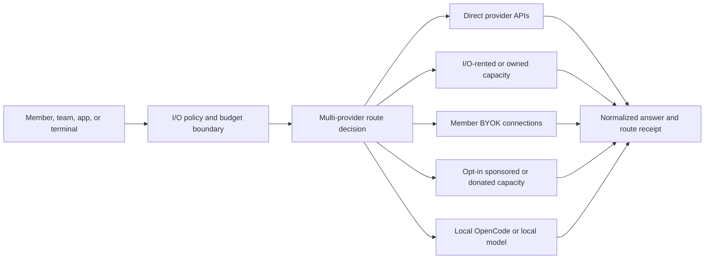

# I/O Port implementation status and multi-provider readiness

Status: local code, UI, and deployed-database assessment, updated 9 August 2026.

This is the operational source of truth for the current I/O Port implementation. It separates what exists from what is only represented in a plan or preview. Cross-product dependencies and release gates are governed by `../../MASTER_IMPLEMENTATION_AND_RELEASE_PLAN.md` and `../../RELEASE_READINESS_CHECKLIST.md`. Product direction remains in `IO_PORT_IMPLEMENTATION_PLAN.md`; the detailed delivery sequence remains in `IO_PORT_CODE_LEVEL_ROADMAP.md`; the OpenRouter comparison is in `OPENROUTER_CAPABILITY_AND_CAPACITY_PLAN.md`.

## 1. Executive verdict

I/O Port is **not operationally routing external provider traffic yet**, but its multi-provider schema, resolver, gateway and redacted evidence plane are Released to the demo project. The hosted registry contains five providers/models/endpoints/capability/price/runtime-control/connection records and three capacity sources/grants. Route receipts and provider attempts remain zero; inventory and configured secret names do not establish conformance or activation.

`20260801152819_enforce_latest_endpoint_conformance.sql` is Released: it binds each conformance result to a capability version from the same endpoint and makes the latest capability plus latest conformance run the shared rule for operator snapshot, activation and runtime resolution. The resolver must still not be treated as activation-grade until reviewed inventory exists and one endpoint passes conformance, budget and explicit spend gates.

The deployed gateway resolves approved registry connections through a service-role-only resolver, allows only approved `IO_PROVIDER_*_API_KEY` secret references, evaluates entitled candidates across providers, supports provider-aware OpenAI-compatible and Gemini-native request adapters, performs bounded fallback for safe upstream failures, and writes a redacted route receipt plus per-provider attempts. The receipt now preserves its selected currency so unlike currencies are never summed. The browser can request latest-affordable, lowest-cost, or an approved explicit model and display its RLS-scoped receipt history. None of this by itself activates a provider or sends traffic.

Provider API keys by themselves do not make a provider routable. The verified deployed cohort counts are:

| Deployed record                        | Count |
| -------------------------------------- | ----: |
| staged direct `io_providers`           |     5 |
| staged `io_models`                     |     5 |
| staged `io_model_endpoints`            |     5 |
| draft capability versions              |     5 |
| published evidence-backed price cards  |     5 |
| testing endpoint connections           |     5 |
| runtime controls                       |     5 |
| `private.io_provider_conformance_runs` |     0 |
| ready resolver results                 |     0 |
| `io_route_receipts`                    |     0 |
| `io_provider_attempts`                 |     0 |
| capacity sources                       |     3 |
| workspace capacity grants              |     3 |

The demo deployment contains metadata and secret references, not key values. No provider completion or billable conformance call was made. The remaining work is no-cost contract testing, trusted operator/conformance workflow, deliberately approved bounded live tests, individual provider activation, idempotency/health/budget controls, billing ledger, OpenRouter/other capacity partnerships and a fuller live control room.

## 2. What “I/O Port” must mean

A port is not one provider hidden behind one endpoint. It is a governed exchange with multiple possible capacity sources:



The member must be able to understand which model, provider, serving region, data policy, capacity class, price card, and fallback rule applied. “Latest and affordable” is one selection strategy inside this larger policy boundary; it is not the whole router.

## 3. Implemented and verified

### 3.1 Product and UI foundation

- Public `/io-port` accurately describes the gateway and control room as private beta and the terminal as next. It does not claim that providers or public capacity are live.
- Authenticated top-level `/io` has its own branded product shell and accepts any signed-in Indus Orbit identity without Community onboarding, location, vouch or verification. `/app/io` redirects before the Community gate.
- The Community switch opens `/app`; a nonmember sees an explicit I/O-versus-Community choice and setup starts only after a deliberate Community action.
- The working overview can create/select a workspace, display entitled capacity sources and safe audit events, select Observe/Plan/Build/Run, and choose between local OpenCode and a provider-partnership path.
- The provider path calls a safe catalogue action and presents `Latest + affordable`, `Lowest cost`, and an explicit reviewed-model selector. It remains disabled until the gateway returns an entitled reviewed route.
- The nested I/O shell now uses working section navigation and a truthful evidence guide. Preview-only workspace, health and activity claims were removed; live workspace, capacity, audit and receipt facts remain inside the member-owned surface.
- The route-evidence ledger shows the latest twelve RLS-scoped receipts with provider/model, route strategy, capacity/residency, attempts, failures/fallbacks, token use and currency-labelled estimate. It stores and renders no prompt or response body.

### 3.2 Supabase control plane

- RLS-protected workspaces, memberships, projects, environments, capacity sources, workspace grants, route-policy records, API-key metadata, and append-only audit-event foundations exist.
- Personal workspace creation is an authenticated atomic RPC instead of a browser-controlled multi-table write.
- Capacity provenance distinguishes local/owned, partner, and sponsored sources.
- Provider, model, endpoint, versioned capability, and versioned pricing tables exist.
- Endpoint connection details and conformance runs are kept in the private schema rather than exposed through the browser Data API.
- The dynamic-model migration adds reviewed release dates and `economy`/`balanced`/`premium` automatic-route tiers.
- A private provider runtime-control table and append-only control-event table are deployed. Five provider runtime controls and five endpoint connections currently exist.
- The separate `admin-indus-orbit` application has a capability-checked I/O readiness/control room. The browser receives lifecycle and conformance states but no credential value, prompt or generated content.
- `20260809174030_create_admin_io_evidence_rpcs.sql` is Released. It adds capability-checked aggregate evidence and keyset-paginated redacted receipt RPCs, a global receipt-time index and currency evidence on receipts. Anonymous execution is revoked and regular members fail closed.
- The admin application consumes those RPCs to show readiness, capacity/grant, route/attempt, token and currency-separated estimated-cost evidence plus older-receipt pagination. It does not receive workspace/user IDs, prompts, outputs, credentials, endpoint URLs or raw provider errors.
- Local Verified migration source now rejects a historical passing run after any newer failed/running/cancelled run, rejects a pass for an older capability version, enforces same-endpoint capability references, and prevents an eligible endpoint from making an ineligible sibling routable.

### 3.3 Deployed gateway foundation

- Active `io-gateway` version 18 verifies a user token, active workspace membership, active capacity entitlement, request shape, message limits, and CORS origin.
- Provider credentials remain server-side.
- Requests and outcomes write redacted audit metadata without prompt or response text.
- The selector fails closed unless an entitled provider, model, endpoint, verified chat capability, active capacity source, and effective member-visible price card are eligible.
- It supports `latest_affordable`, `lowest_cost`, and an explicit reviewed model. Automatic selection has a configurable tier, freshness window and affordability band; mixed currencies fail closed until reviewed FX conversion exists.
- An approved connection can resolve only an allowlisted `IO_PROVIDER_*_API_KEY` secret name. The browser receives neither endpoint URL nor credential.
- The adapter currently normalizes non-streaming OpenAI-compatible Chat Completions and Gemini native `generateContent`; it validates response shapes and normalizes token use and a safe provider request ID.
- Dispatch defaults to one provider attempt. Operator-enabled fallback is capped at three through `IO_PROVIDER_MAX_ATTEMPTS` and remains unsuitable for paid traffic until idempotency, reservation and policy controls exist.
- The deployed forward-only migrations introduce append-only `io_route_receipts` and `io_provider_attempts`. They exclude prompts, generated text, credentials, headers and raw upstream errors; selected currency is retained for valid aggregation.
- A follow-up migration covers every receipt/attempt provider, model, endpoint and capacity foreign key used for operator history and reconciliation; the Performance Advisor reports no remaining unindexed foreign key in the new I/O evidence tables.
- `20260809182509_add_io_conformance_composite_index.sql` additionally covers the private endpoint/capability conformance relationship; the hosted migration record and index are independently verified.

### 3.4 Local terminal and conversation foundation

- The browser can connect only to a credential-free root loopback OpenCode origin over HTTP; paths, query strings, fragments and embedded URL credentials are rejected, while an optional OpenCode password is held in memory.
- The proof validates OpenCode health/session/message objects, encodes the returned session ID, performs prompt delivery, and reports safe-audit failure separately from local execution success.
- Existing direct messages remain the human conversation source. I/O prompts and terminal work are not inserted into `direct_messages`.
- Direct-message RLS/read permissions were hardened, and both the full Messages surface and compact chat now reuse shared hooks and event-driven unread reconciliation.

### 3.5 Repository verification

| Check                                  | Result          | Interpretation                                                                                                                                 |
| -------------------------------------- | --------------- | ---------------------------------------------------------------------------------------------------------------------------------------------- |
| `npm run build`                        | Pass            | The current web application produces a production bundle.                                                                                      |
| `npm run typecheck`                    | Pass            | Current browser/server TypeScript compiles.                                                                                                    |
| `npm run format:check`                 | Pass            | Mechanical formatting drift has been removed.                                                                                                  |
| `npm run test:unit`                    | Pass — 38/38    | Auth/product/location, schema compatibility, conversations, OpenCode, gateway/adapters/routing and fixed email-template rendering are covered. |
| `npm run audit:high`                   | Pass            | No critical, high or moderate dependency advisory remains.                                                                                     |
| I/O-focused ESLint run                 | Pass            | `src/features/io` and I/O routes pass current lint rules.                                                                                      |
| Repository-wide `npm run lint --quiet` | Pass — 0 errors | The local semantic lint gate now passes across the repository.                                                                                 |
| Automated I/O/router contract tests    | 19/19 pass      | OpenCode, validation, selection/attempt bounds and provider request/error fixtures pass.                                                       |
| Empty Supabase migration replay        | 64/64 pass      | Every checked-in migration replays from zero on the local demo stack.                                                                          |
| Database provider/ACL/schema contracts | 446/446 pass    | Covers provider/evidence ACLs, product/location, notifications, direct messages and Chapter/Mission Spaces.                                    |
| Supabase schema lint                   | Pass            | The local `public` and `private` schemas report no lint errors.                                                                                |
| Hosted Space release contract          | Pass            | No missing migration/table/function; 19/19 Space tables use RLS; direct protected writes are false; Realtime publication is true.              |
| Hosted public generated types          | Partial         | Checked-in types match clean local schema; repeatable hosted drift automation remains.                                                         |
| Provider conformance tests             | None recorded   | No provider is operationally certified.                                                                                                        |

## 4. Implemented, but requires improvement

| Area                      | What exists                                                                                                                                         | Why it is insufficient                                                                                                       | Required improvement                                                                                      |
| ------------------------- | --------------------------------------------------------------------------------------------------------------------------------------------------- | ---------------------------------------------------------------------------------------------------------------------------- | --------------------------------------------------------------------------------------------------------- |
| Provider connection       | Five deployed private connection records use distinct provider-specific secret references                                                           | All remain testing and no conformance result exists                                                                          | Add audited conformance workflow, then activate one approved connection at a time                         |
| Dynamic model selection   | Local source compares entitled, priced candidates across connections                                                                                | It does not yet apply formal route-policy versions, health, latency, budget, FX, cached pricing, or user policy              | Add hard policy filters and versioned scoring inputs before activation                                    |
| Provider registry         | Sound public/private schema split with five provider/model/endpoint/price/connection records                                                        | Records remain unproven until secret references, evidence and conformance are reviewed                                       | Add operator onboarding, evidence refresh, deprecation and lifecycle workflows                            |
| Provider adapter          | Local source has OpenAI-compatible and Gemini-native non-streaming adapters                                                                         | No streaming, tools, structured output, multimodal, cancellation, or conformance matrix                                      | Add tested adapter capabilities one provider at a time                                                    |
| Request validation        | Strict request and normalized response validation                                                                                                   | Streaming frames and provider-specific error schemas are not versioned                                                       | Add schemas and contract tests for each supported feature                                                 |
| Reliability               | 45-second timeout, rate-limit classification, one attempt by default and an explicit maximum of three                                               | No idempotency, circuit breaker, health sampling, monetary retry budget, queue state, or cancellation                        | Keep fallback disabled for paid traffic until those controls exist                                        |
| Audit                     | Immutable receipts/attempts, member receipt history and capability-checked admin aggregate/paginated evidence are Released; live counts remain zero | No conformance route has produced one; policy/health/budget snapshots remain incomplete                                      | With spend approval, verify one bounded conformance receipt and reconcile it with the eventual ledger     |
| Cost estimate             | Character-count token approximation, input/output list price and immutable currency code; admin totals group by currency                            | This is not billing and ignores cached input, tools/media, provider-specific units, FX, fee, tax and actual settlement       | Add versioned estimation plus reserve-and-settle ledger in integer minor units                            |
| Capacity truth            | Three labelled demo sources and grants                                                                                                              | The generic partner/sponsored demo records currently carry `IN` region/residency metadata without provider-specific evidence | Change unknown facts to unknown; attach India claims only to a certified endpoint and evidence version    |
| Auth runtime              | JWT check with legacy anon/service-role environment variables                                                                                       | It works, but newer publishable/secret key rotation and narrower privileged access should be planned                         | Move to current Supabase key conventions and keep admin client use inside the smallest possible functions |
| Web control room          | Workspace, terminal, working section navigation, route/model selection, receipt history, capacity and safe audit cards                              | No pre-run estimate, candidate explanation, provider health, budget/credit/invoice view or richer receipt paging/filtering   | Add authorised policy, budget, health and billing APIs before paid beta                                   |
| Local OpenCode            | One browser-local run and safe audit                                                                                                                | No resume, timeline, tool/approval view, diff, artifacts, task tree, attach/detach, or recovery                              | Add durable I/O session metadata while keeping local content local unless explicitly shared               |
| Conversation client       | Shared hooks and better DM RLS                                                                                                                      | Separate hook instances, no cursor paging, no common store, no private Broadcast, no I/O workspace conversations             | Complete the shared store/RPC/realtime plan before adding group collaboration                             |
| Operational documentation | Plans and provider inventory exist                                                                                                                  | Earlier secret guidance could be read as multi-provider activation, which is incorrect                                       | Treat this document and the corrected operating guide as the current source of truth                      |

## 5. Entirely left to implement

### 5.1 Multi-provider route transaction

The following production transaction does not exist yet:

1. accept an idempotent normalized request with workspace, project, policy, capability, quality, budget, data, origin, and fallback constraints;
2. load all active, entitled, contractually approved connections;
3. hard-filter by capacity class, model origin, serving region, retention/training class, capability, context, model lifecycle, budget, and provider health;
4. snapshot the exact policy, registry, capability, health, and price versions;
5. estimate each remaining candidate and select deterministically;
6. reserve the maximum allowed budget;
7. dispatch one recorded provider attempt;
8. retry only when safe and fall back only within the member-approved fallback class;
9. normalize content, usage, provider request reference, and error;
10. settle actual usage, release unused reserve, and emit an immutable route receipt;
11. return the answer plus receipt ID, selected model revision, provider/capacity disclosure, cost, region/retention disclosure, and fallback outcome.

### 5.2 Missing durable records

At minimum, production routing still needs:

```text
io_route_definitions
io_endpoint_health_samples
io_idempotency_records
io_budget_limits
io_usage_reservations
io_usage_records
io_ledger_transactions
io_ledger_entries
io_credit_grants
io_fee_rule_versions
io_fx_rate_versions
io_invoice_runs
io_invoice_lines
io_payment_events
```

Durable terminal work still needs `io_sessions`, session members, events, approvals, artifacts, tasks, handoffs, and retention controls. Long-running agent execution must not be placed inside a Supabase Edge Function.

### 5.3 Missing operational surfaces

- operator provider/connection/model/endpoint/evidence/price onboarding;
- conformance runner and signed review/activation flow;
- live provider and endpoint health/status page;
- member policy, provider/model, BYOK, budget, and fallback controls;
- pre-run estimate and post-run route receipt;
- usage, credits, invoice, export, and reconciliation views;
- on-call dashboards, alerts, SLOs, incident playbooks and key rotation (the first provider kill switch is now implemented);
- API/CLI contracts, versioning, rate limits, API key issuance, and SDK documentation.

## 6. The API keys already added

Do not paste or commit any key. Keep each provider under a unique Supabase Edge Function secret name.

The deployed registry/gateway contract uses one unique secret per provider:

```text
IO_PROVIDER_OPENAI_API_KEY
IO_PROVIDER_XAI_API_KEY
IO_PROVIDER_GEMINI_API_KEY
IO_PROVIDER_DEEPSEEK_API_KEY
IO_PROVIDER_GROQ_API_KEY
IO_PROVIDER_SARVAM_API_KEY       # only after partnership/conformance
IO_PROVIDER_OPENROUTER_API_KEY   # only if OpenRouter capacity is contracted
```

The first five names exist in the Supabase Edge Function secret store. Their values were not read, copied or exposed during registry deployment. Additional provider and owned-capacity secrets follow the same unique-name rule. Canonical endpoint URLs, provider identity, account scope, and the secret **name** belong in `private.io_endpoint_connections`; the secret value remains only in the Edge Function secret store.

The deployed gateway reads a provider-specific value only after the service-role-only registry resolver approves its connection and the reference matches `IO_PROVIDER_[A-Z0-9_]+_API_KEY`. The current five rows use the five exact first-cohort names above, but they remain testing and therefore resolve to no route.

Legacy `IO_PARTNER_BASE_URL`, `IO_PARTNER_API_KEY` and `IO_PARTNER_PROVIDER_KEY` values, if still present, are no longer the current multi-provider contract. Do not overwrite one legacy name repeatedly to add providers.

GitHub repository secrets are not used by the current runtime because this repository has no workflow that synchronizes them into Supabase. Production provider credentials belong in Supabase Edge Function secrets unless a narrowly scoped deployment workflow is deliberately added later.

The credential resolver must not accept an arbitrary environment-variable name from a browser request. Only operator-approved connection rows, restricted secret-name patterns, and allowlisted adapter types may cause a secret lookup.

## 7. First useful provider cohort

The keys already available make a practical engineering cohort, not an India-residency cohort:

| Lane                                       | Initial connection                              | Purpose                                                       | Mandatory disclosure                                                          |
| ------------------------------------------ | ----------------------------------------------- | ------------------------------------------------------------- | ----------------------------------------------------------------------------- |
| Global commercial                          | OpenAI                                          | Baseline quality/tool/structured-output adapter               | Actual endpoint terms, serving/data policy, price version                     |
| Global commercial                          | xAI                                             | Independent provider and failure-domain comparison            | Same, without implying India residency                                        |
| Global commercial                          | Gemini                                          | Native adapter/conformance path                               | Same, with exact model and API surface                                        |
| Global commercial / model-origin-sensitive | DeepSeek                                        | Affordable model/provider comparison only when policy permits | Model origin, provider, serving region, retention, and explicit opt-in policy |
| Local                                      | OpenCode and later approved local models        | Device-local agent and coding route                           | What remains local and what audit metadata is shared                          |
| India direct/capacity                      | Sarvam plus an approved Indian capacity partner | India-language, economic, and placement lane                  | Written region, retention, commercial/resale, support, and price evidence     |

No global connection may satisfy an `india-only` policy merely because the Supabase control plane is in Mumbai. The inference endpoint's verified serving and data-processing facts govern the route.

## 8. Required router architecture

### 8.1 Connection resolution

Implemented locally in `20260801003835_io_route_receipts_and_registry_router.sql`: a restricted service-role-only resolver returns eligible connection records:

```text
provider_id
endpoint_id
adapter_kind
base_url
secret_reference
account_scope
connection_state
conformance_state
last_verified_at
```

The gateway resolves `secret_reference` only after the connection and endpoint pass operator activation, conformance, entitlement, and policy checks.

### 8.2 Adapter interface

The first stable interface should cover:

```text
discoverModels()
createChat()
streamChat()
cancel()
normalizeUsage()
normalizeError()
healthCheck()
```

Each adapter publishes tested capabilities rather than claiming universal compatibility. Begin with an OpenAI-compatible adapter family and a Gemini-native adapter. Add modality-specific adapters only after chat routing is reliable.

### 8.3 Candidate evaluation

Hard constraints are boolean and run before scoring:

```text
membership and entitlement
capacity class and BYOK ownership
serving region and retention/training policy
model origin and licence policy
required capabilities and context
model/endpoint lifecycle
maximum estimated cost
connection/conformance state
circuit and health state
```

Only eligible candidates are scored. Score weights must be policy-versioned and explainable. Recommended dimensions are expected quality for the request class, price, recent latency, recent success rate, freshness, and India/partnership preference. Reliability and policy are never silently traded for a lower price.

### 8.4 Fallback and safety

- A retry is the same endpoint and is permitted only for a classified transient failure and an idempotent request.
- A fallback changes endpoint/provider and must be listed in the policy and route receipt.
- India-only, local-only, BYOK-only, no-retention, or model-origin exclusions survive every fallback.
- Circuit breakers stop sending traffic to a degraded endpoint.
- Per-workspace and per-provider rate limits prevent one tenant from exhausting shared capacity.
- Provider request identifiers are stored safely for reconciliation; raw provider errors and secrets are never returned to the browser.

## 9. Ordered implementation phases and exit criteria

### Phase A — truthful state and credential contract

**Deployment progress:** items 1 and 3 are deployed. Five connections coexist safely, but the exit criterion remains open until diagnostics and conformance workflow exist.

1. Preserve provider-specific secrets and stop treating `IO_PARTNER_*` as the target contract. Deployed code accepts only restricted `IO_PROVIDER_*_API_KEY` references from approved connection rows.
2. Correct generic demo residency/region fields to unknown until endpoint evidence exists.
3. Add a server-only connection resolver with a strict secret-reference allowlist.
4. Add current-state/admin diagnostics that report configured connection names and states, never secret values.

Exit: four provider connections can coexist in private records without any being member-routable.

### Phase B — conformance and provider activation

**Local source progress:** item 1 is implemented for non-streaming chat; no conformance result exists.

1. Implement normalized OpenAI-compatible and Gemini-native adapters.
2. Build recorded tests for model discovery, non-streaming/streaming, cancellation, tools/structured output where advertised, usage, 401/403/429/5xx/timeout mapping, and provider request IDs.
3. Record exact model revisions, capabilities, serving/retention evidence, and effective prices.
4. Require operator review before activation.

Exit: each activated endpoint has a passing conformance run and immutable evidence/price versions.

### Phase C — multi-provider router and receipts

**Local source progress:** receipts/attempts, registry candidate loading, deterministic selection, bounded failure fallback, normalized errors, receipt response and web display are implemented. Route definitions, idempotency, health/circuit state, policy snapshots and a full policy engine remain open.

1. Add named route definitions, idempotency records, health samples, receipts, and attempts. Receipts/attempts are in the new local migration.
2. Replace `readPartnerConfig()` with registry candidate loading across providers. Implemented locally.
3. Apply policy hard filters, then dynamic score/selection. Entitlement, lifecycle, capability, context, tier and price filters plus deterministic selection are local; broader policy filters remain.
4. Add bounded retry, approved fallback, circuit breakers, and normalized errors. Ordered fallback and normalized errors are local; retries/circuit breakers need policy/idempotency.
5. Return and display route receipt IDs. Implemented locally.

Exit: one request can deterministically choose among at least three providers, survive a simulated provider failure without violating policy, and explain the decision.

### Phase D — member web UI and API

**Local source progress:** items 1 and the completed-route part of item 3 are implemented; they depend on the new gateway/catalogue to become live.

1. Replace the generic Provider partnership button with policy-first Auto route plus explicit model/provider choices.
2. Show model origin, provider, serving region, retention, capacity class, capability, current price version, health, and estimated range before execution.
3. Show selected route, attempts/fallbacks, actual usage, and receipt after execution.
4. Connect the context sidebar and inspector to live authorized data; remove preview fixtures as their real counterparts land.
5. Publish a versioned OpenAI-compatible I/O API only after the same policy and receipt path is used by the web UI.

Exit: a member can make an informed choice and inspect the result without operator/database access.

### Phase E — budgets, pricing, and capacity classes

1. Implement reserve-and-settle in paise with versioned upstream price, FX, I/O fee, credits, and tax lines.
2. Add BYOK ownership and isolation.
3. Add I/O-rented/owned capacity metering and opt-in sponsored/donated grants.
4. Reconcile sample I/O receipts against provider invoices before paid beta.

Exit: no paid or sponsored dispatch can occur without a reservation, settlement, and balanced ledger transaction.

### Phase F — terminal, conversations, and beta operations

1. Add durable terminal session metadata, resume/attach, tool and approval timeline, diff/artifact/task views, and explicit sharing.
2. Complete the shared conversation store, cursor paging, RPC send/read boundary, and private Realtime Broadcast.
3. Add I/O workspace conversations and session handoffs without copying private terminal content into human messages.
4. Add automated unit, integration, RLS, adapter-contract, router-failure, ledger-property, load, and end-to-end tests.
5. Establish SLOs, alerts, runbooks, key rotation, incident response, provider kill switches, backups, and external security review.

Exit: a capped private cohort can operate under measured reliability, spend, privacy, and support controls.

## 10. Immediate next code slice

The highest-leverage next slice is **make the Released boundary reproducible, then finish provider conformance without enabling general traffic**:

1. reconcile the 26 historical migration timestamp aliases and keep the proven fresh 64-migration/446-test gate required in CI;
2. run I/O-only, Community opt-in, existing-member and location-consent browser personas;
3. add operator-only aggregate measurement with small-cohort suppression and validate withdrawal in browser personas;
4. build the provider evidence/conformance runner and two-person activation review;
5. run only explicitly approved, bounded provider conformance calls and store sanitized results;
6. add budget reservation, idempotency, health and kill-switch evidence before making any provider routable.

## 11. Verification basis and limits

This assessment uses local source, the clean 64-migration/446-assertion baseline, current member/admin build/type/format/lint/unit checks, an authenticated linked release, the Chapter/Mission Space and I/O evidence hosted contracts, and live Advisors. Production approval is not claimed.

The connected Supabase tools do not expose Edge Function secret names or values. Consequently this audit confirms what names the code reads and what provider records exist, but it cannot confirm which provider-specific secrets the operator added. No secret should be copied into an issue, chat, document, log, table, or repository to overcome that limitation.

The top-level `/io` route, explicit Community gate and optional country-first location journey are Released to the demo database and remotely verified at the schema/grant/backfill level. Their full browser personas remain open. Provider runtime is still off: five provider/model/endpoint/capability/price/control/connection records and three capacity sources/grants exist, route receipts and provider attempts remain zero, and no provider request, secret read or paid traffic was performed during this release.
