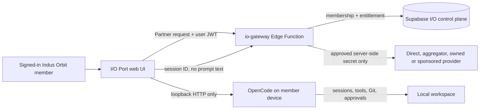

# I/O Port operating guide

Operational truth, updated 1 August 2026: the registry-driven multi-provider foundation and `io-gateway` v17 are deployed to the demo project. Five providers are staged, but every connection/capability/provider/endpoint remains gated and the ready resolver returns zero routes. Read `IO_PORT_IMPLEMENTATION_STATUS.md` before activating traffic.

## What is live in the demo project

I/O Port is one web workspace with two execution boundaries:

1. **Provider partnership route** — the browser calls the authenticated `io-gateway` Edge Function. The gateway verifies workspace membership and an active capacity grant, resolves only fully approved registry connections, selects an entitled candidate, and can call OpenAI-compatible or Gemini-native APIs. It writes a redacted route receipt/attempt trail that excludes prompt and response text. No current provider passes all activation gates, so no external request is sent.
2. **I/O Terminal route** — the browser talks directly to a member's own OpenCode server running on loopback. OpenCode keeps the agent session, tool permissions, filesystem, terminal, and Git state on that device. I/O records only the connector origin and OpenCode session ID after the run succeeds.

The web surface is `/app/io`. It reuses the existing authenticated Indus Orbit shell, conversation dropdown, member context, missions, and skills rather than introducing another community system.

The nested I/O layout is still a **preview shell**: its workspace label, availability indicator, navigation counts and inspector activity cards are illustrative until the code-level roadmap connects each of them to authorized live data. The runnable session controls and capacity/audit cards in the overview are the current live demo elements.

## Data and control flow



The capacity tables maintain the distinction between partner, rented/owned, donated, and sponsored capacity. A source is never made routable merely because it exists: its operational status and workspace grant must both be active.

## Web UI behaviour

- A signed-in member without an I/O workspace sees a single **Create workspace** action. The authenticated `create_my_io_workspace` RPC creates (or safely recovers) the caller's personal tenant boundary, immutable owner membership and a minimal audit event as one transaction. It accepts no browser-supplied owner, workspace, destination or credential values.
- The capacity cards come from the member's real workspace grants and disclose source status and public terms.
- Selecting **I/O Terminal** allows only `localhost`, `127.0.0.1`, or `::1` over HTTP. The password field is in-memory only and never stored in Supabase.
- Selecting **Provider partnership** disables direct browser-provider access. The web UI loads only a safe entitled model catalogue, offers latest-affordable, lowest-cost or explicit-model selection, and disables execution until an approved route is present.
- The audit panel deliberately stores route metadata, model identifier, token counts, connector origin, and session ID—not the prompt, response, raw key, or OpenCode password.
- Gateway v17 separates HTTP handling, request validation, membership, entitlement, registry route selection, redacted receipt writing and provider-aware OpenAI-compatible/Gemini-native adapters. Its public errors are structured; internal/provider details and credentials are not returned to the browser.

## Start a local OpenCode terminal

Install OpenCode on the member machine, then start a loopback server that explicitly allows the local Indus Orbit development origin. In this review session Indus Orbit is running on port `5174`; use `5173` instead if that is the port Vite assigns on a later start:

```bash
opencode serve --port 4096 --cors http://127.0.0.1:5174
```

For a password-protected server, set `OPENCODE_SERVER_PASSWORD` before starting OpenCode and enter that password in I/O Terminal. The UI uses the OpenCode HTTP APIs for health, session creation, and message delivery, so the user retains OpenCode's native sessions, tool approvals, diffs, terminal, and Git controls.

For a deployed Indus Orbit site, include its exact origin as an additional `--cors` value. Do not bind OpenCode to a public network interface just to use I/O Terminal.

## Deployed multi-provider secret contract

Provider keys are retained under unique Supabase Edge Function secret names:

```text
IO_PROVIDER_OPENAI_API_KEY
IO_PROVIDER_XAI_API_KEY
IO_PROVIDER_GEMINI_API_KEY
IO_PROVIDER_DEEPSEEK_API_KEY
IO_PROVIDER_GROQ_API_KEY
```

The gateway stores only each secret name in a private connection record, resolves it server-side only after a service-role-only resolver approves the endpoint, and queries all eligible providers. The reference must match `IO_PROVIDER_[A-Z0-9_]+_API_KEY`; endpoint URLs and connection state belong in the private registry; secret values never belong in a table, browser, log, document, or repository. The five current records are `testing`, so the gateway cannot resolve or use their values yet.

Legacy `IO_PARTNER_*` secrets, if present, do not represent the current registry contract. Do not overwrite one legacy name repeatedly to add providers. `IO_PARTNER_DEFAULT_MODEL` remains retired; the reviewed registry/policy selects the model.

Adding secrets in GitHub does not configure the current runtime: this repository has no workflow that synchronizes GitHub secrets into Supabase. Use Supabase Edge Function secrets for runtime credentials unless a narrowly scoped deployment workflow is deliberately implemented later.

Optional server-only selector controls have safe defaults:

| Secret                                        | Default    | Meaning                                                                                          |
| --------------------------------------------- | ---------- | ------------------------------------------------------------------------------------------------ |
| `IO_MODEL_SELECTION_TIER`                     | `balanced` | One of `economy`, `balanced`, or `premium`. Models marked `manual_only` are never auto-selected. |
| `IO_MODEL_SELECTION_FRESHNESS_DAYS`           | `180`      | How close to the newest reviewed release a candidate must be.                                    |
| `IO_MODEL_SELECTION_AFFORDABILITY_MULTIPLIER` | `1.35`     | Maximum estimated-cost multiple above the cheapest fresh candidate.                              |

For each local-router request, I/O considers only models whose provider is active; model is listed, release-dated and not deprecated; endpoint is active/member-visible; capacity source is actively entitled; latest capability certificate verifies chat; and a published price card is currently effective. It estimates the current request cost from the message length plus the 1,024-token output cap. `latest_affordable` uses the tier, freshness and affordability bands; `lowest_cost` selects the least costly eligible candidate; an explicit model must be in the reviewed catalogue. Mixed currencies fail closed until FX data is reviewed. Safe upstream/rate-limit failures may advance to the next deterministic candidate and the final route/attempts are recorded without prompt or response text. This is routing, not billing: paid use still requires the P2 reserve-and-settle ledger.

The deployed registry contains one staged record set for OpenAI, SpaceXAI/xAI, Gemini, DeepSeek and Groq. Before any route is activated, run and review provider conformance, verify current data/region terms, confirm the price card and model revision, then transition connection, capability, endpoint and provider states through an audited admin workflow. The gateway refuses to route while any condition is unmet.

The existing `partner-gateway` source is only a generic demo record. Its `IN` region/residency metadata must not be used as evidence for a global provider. Unknown endpoint location stays unknown until a provider-specific endpoint carries reviewed evidence.

## Current demo records

The demo project has one member-owned `Indus Orbit demo` workspace and three visibly labelled sources:

- **Local OpenCode terminal** — active local-only route.
- **Partner model gateway** — active entitlement to the staged cohort, but no provider connection is ready; therefore no external route exists regardless of whether API keys exist in the secret store.
- **Sponsored capacity commons** — awaiting sponsor terms and eligibility policy.

The deployed gateway accepts the standard local Vite origins on ports `5173` and `5174`, alongside the Indus Orbit production origins. Other origins remain rejected.

## Guardrails before public beta

1. Add an operator-only capacity management screen; the current browser UI is intentionally member-facing.
2. Add ledger and budget reservation tables before enabling paid traffic.
3. Add SQL/RLS tests and operator diagnostics for the deployed private connections, restricted secret-reference resolver, route receipts and provider attempts.
4. Add rate limiting, idempotency keys, health/circuit controls, streaming and cancellation handling to `io-gateway` before broad access.
5. Add provider-specific conformance, evaluation, residency, retention, formal fallback policy and route-policy versioning before activating multiple routes.
6. Add a reserve-and-settle ledger before any paid or sponsored traffic.
7. Run an external security review of the pre-existing Supabase SECURITY DEFINER warnings. The deliberate authenticated `create_my_io_workspace` RPC also appears in the Security Advisor because it is a `SECURITY DEFINER` function callable by signed-in members; it is restricted to no arguments, `auth.uid()`, an empty search path, and its own creator/membership/audit writes. Keep that invariant and re-review it whenever the function changes.
