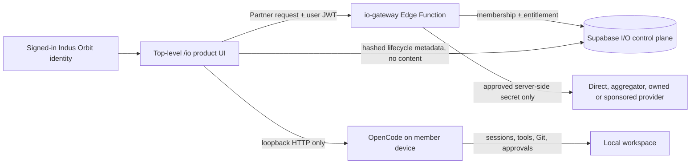

# I/O Port operating guide

Operational truth, updated 12 August 2026: the registry-driven multi-provider foundation, latest-evidence resolver, `io-gateway` v19, top-level `/io` boundary, budget/idempotency/ledger/health/circuit controls, terminal metadata and safe-timeline/approval boundary are Released to the demo. The hosted release contract confirms RLS/grants/containment; the last inventory has five provider/model/endpoint/capability/price/runtime-control/connection records, three capacity sources/grants and zero receipts/attempts. Secrets and inventory alone do not prove conformance or activate routing. Read `IO_PORT_IMPLEMENTATION_STATUS.md` before any inventory or traffic change.

## What is live in the demo project

I/O Port is one web workspace with two execution boundaries:

1. **Provider partnership route** — the browser calls the authenticated `io-gateway` Edge Function. The gateway verifies workspace membership and an active capacity grant, resolves only fully approved registry connections, selects an entitled candidate, and can call OpenAI-compatible or Gemini-native APIs. It writes a redacted route receipt/attempt trail that excludes prompt and response text. No current provider passes all activation gates, so no external request is sent.
2. **I/O Terminal route** — the browser talks directly to a member's own OpenCode server running on loopback. OpenCode keeps the agent session, tool permissions, filesystem, terminal and Git state on that device. The new local code records only safe lifecycle and constrained timeline metadata; the connector origin and OpenCode session ID are stored only as SHA-256 hashes. Prompt, output, code, commands, paths and credentials are excluded. A stored approval decision is audit state, never permission to execute.

The canonical web surface is `/io`, with a distinct I/O Port shell and shared Indus Orbit identity. It does not require a Community segment, profile journey, location choice, vouch or verification. `/app/io` is compatibility-only and redirects before the Community gate. Shared visual primitives and product switching preserve the Indus Orbit system without collapsing I/O into the Community application.

The nested I/O shell uses working anchors and authorized workspace/capacity/audit/receipt facts. The new local UI also reads real budget state and displays a durable safe terminal timeline. Preflight route explanations, detailed live health, credits/invoices, realtime terminal delivery and executable approval controls remain incomplete and must not be represented as live.

## Data and control flow



The capacity tables maintain the distinction between partner, rented/owned, donated, and sponsored capacity. A source is never made routable merely because it exists: its operational status and workspace grant must both be active.

## Web UI behaviour

- A signed-in member without an I/O workspace sees a single **Create workspace** action. The authenticated `create_my_io_workspace` RPC creates (or safely recovers) the caller's personal tenant boundary, immutable owner membership and a minimal audit event as one transaction. It accepts no browser-supplied owner, workspace, destination or credential values.
- The capacity cards come from the member's real workspace grants and disclose source status and public terms.
- Selecting **I/O Terminal** allows only `localhost`, `127.0.0.1`, or `::1` over HTTP. The password field is in-memory only and never stored in Supabase.
- Selecting **Provider partnership** disables direct browser-provider access. The web UI loads only a safe entitled model catalogue, offers latest-affordable, lowest-cost or explicit-model selection, and disables execution until an approved route is present.
- Route evidence stores provider/model/capacity/token/cost metadata and excludes prompts, responses, keys and raw provider errors. Terminal metadata stores hashed runtime references and lifecycle only.
- The Released gateway requires an idempotency key, reserves the total worst-case cost across every allowed attempt before dispatch, records endpoint outcomes and atomically settles actual use or releases the hold. Its public errors remain structured; internal/provider details and credentials are never returned.
- The member UI displays authoritative remaining/reserved/settled budget in integer minor units, disables provider execution without usable budget and lists safe terminal lifecycle records. Its web build still needs hosting deployment and authenticated browser personas.

## Start a local OpenCode terminal

Install OpenCode on the member machine, then start a loopback server that explicitly allows the local Indus Orbit development origin. In this review session Indus Orbit is running on port `5174`; use `5173` instead if that is the port Vite assigns on a later start:

```bash
opencode serve --port 4096 --cors http://127.0.0.1:5174
```

For a password-protected server, set `OPENCODE_SERVER_PASSWORD` before starting OpenCode and enter that password in I/O Terminal. The UI uses the OpenCode HTTP APIs for health, session creation, and message delivery, so the user retains OpenCode's native sessions, tool approvals, diffs, terminal, and Git controls.

For a deployed Indus Orbit site, include its exact origin as an additional `--cors` value. Do not bind OpenCode to a public network interface just to use I/O Terminal.

## Deployed multi-provider secret contract

Provider keys are retained under unique Supabase Edge Function secret names:

```text
IO_PROVIDER_OPENAI_API_KEY
IO_PROVIDER_XAI_API_KEY
IO_PROVIDER_GEMINI_API_KEY
IO_PROVIDER_DEEPSEEK_API_KEY
IO_PROVIDER_GROQ_API_KEY
```

The gateway stores only each secret name in a private connection record, resolves it server-side only after a service-role-only resolver approves the endpoint, and queries all eligible providers. The reference must match `IO_PROVIDER_[A-Z0-9_]+_API_KEY`; endpoint URLs and connection state belong in the private registry; secret values never belong in a table, browser, log, document, or repository. The five current records are `testing`, so the gateway cannot resolve or use their values yet.

Legacy `IO_PARTNER_*` secrets, if present, do not represent the current registry contract. Do not overwrite one legacy name repeatedly to add providers. `IO_PARTNER_DEFAULT_MODEL` remains retired; the reviewed registry/policy selects the model.

Adding secrets in GitHub does not configure the current runtime: this repository has no workflow that synchronizes GitHub secrets into Supabase. Use Supabase Edge Function secrets for runtime credentials unless a narrowly scoped deployment workflow is deliberately implemented later.

Optional server-only selector controls have safe defaults:

| Secret                                        | Default    | Meaning                                                                                          |
| --------------------------------------------- | ---------- | ------------------------------------------------------------------------------------------------ |
| `IO_MODEL_SELECTION_TIER`                     | `balanced` | One of `economy`, `balanced`, or `premium`. Models marked `manual_only` are never auto-selected. |
| `IO_MODEL_SELECTION_FRESHNESS_DAYS`           | `180`      | How close to the newest reviewed release a candidate must be.                                    |
| `IO_MODEL_SELECTION_AFFORDABILITY_MULTIPLIER` | `1.35`     | Maximum estimated-cost multiple above the cheapest fresh candidate.                              |

For each request, I/O considers only models whose provider is active; model is listed, release-dated and not deprecated; endpoint is active/member-visible; capacity source is actively entitled; latest capability certificate verifies chat; and a published price card is effective. The local resolver also excludes open circuits. `latest_affordable` uses tier, freshness and affordability bands; `lowest_cost` selects the least costly eligible candidate; an explicit model must be in the reviewed catalogue. Mixed currencies fail closed until FX data is reviewed.

The local operational core computes a conservative byte-based upper-bound when provider usage is not yet known, reserves the summed worst-case cost of all configured attempts before any dispatch, and settles provider-reported usage when complete or explicitly labelled estimated usage otherwise. Every settle/release transaction balances in integer minor units. This is an activation-grade route-cost core, not a complete invoicing/tax/payment system.

The deployed registry contains one staged record set for OpenAI, SpaceXAI/xAI, Gemini, DeepSeek and Groq. Before any route is activated, run and review provider conformance, verify current data/region terms, confirm the price card and model revision, then transition connection, capability, endpoint and provider states through an audited admin workflow. The gateway refuses to route while any condition is unmet.

The existing `partner-gateway` source is only a generic demo record. Its `IN` region/residency metadata must not be used as evidence for a global provider. Unknown endpoint location stays unknown until a provider-specific endpoint carries reviewed evidence.

## Current demo records

The demo project has one member-owned `Indus Orbit demo` workspace and three visibly labelled sources:

- **Local OpenCode terminal** — active local-only route.
- **Partner model gateway** — active entitlement to the staged cohort, but no provider connection is ready; therefore no external route exists regardless of whether API keys exist in the secret store.
- **Sponsored capacity commons** — awaiting sponsor terms and eligibility policy.

The deployed gateway accepts the standard local Vite origins on ports `5173` and `5174`, alongside the Indus Orbit production origins. Other origins remain rejected.

## Release the locally Verified slice

1. Authenticate the Supabase CLI against linked project `jpwvgpnbkrktipwhvqss`.
2. Inspect hosted migration drift and apply `20260810002754_create_io_operational_core.sql` and `20260810010415_create_io_terminal_session_foundation.sql`.
3. Deploy the updated `io-gateway` with JWT verification enabled.
4. Regenerate/compare hosted database types and run RLS/RPC/admin contract tests.
5. Deploy the member and admin web builds only after steps 2–4 pass.
6. Do not make a provider request during release verification. Conformance traffic is a separate spend-approved operation.

## Guardrails before public beta

1. Release and concurrency-test the budget/idempotency/ledger/health/circuit core before enabling paid traffic.
2. Build operator provider evidence, conformance, secret-reference and capacity/grant lifecycle workflows.
3. Add provider-specific conformance, region/retention evidence, formal fallback policy and immutable route-policy snapshots before activating multiple routes.
4. Add scheduled probes, distributed rate limits, streaming and cancellation before broad access.
5. Add credits, fees, reviewed FX, tax, invoices, payments/refunds and provider-bill reconciliation before commercial launch.
6. Keep terminal content local; add trusted approval enforcement before exposing tools/commands and explicit sharing before handoffs.
7. Run external security/privacy review and re-review every `SECURITY DEFINER` boundary whenever it changes.
