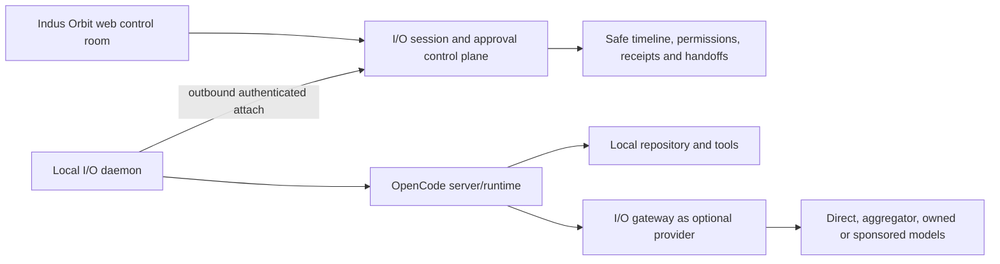

# OpenCode adoption plan for I/O Terminal

Status: current upstream capability review and implementation gap, 1 August 2026.

## Adoption decision

OpenCode is a strong MIT-licensed foundation for the local coding-agent runtime and protocol. I/O should use its server/OpenAPI/session/agent/tool concepts and, where appropriate, its SDK or separately built client components. I/O should not pretend that the current three-call proof equals the full OpenCode product, and should not merge OpenCode’s Solid UI wholesale into the React application.

OpenCode’s repository is MIT licensed; copied or substantially reused source must retain the required copyright and license notice. The official server exposes an OpenAPI-described HTTP API covering projects, paths/VCS, configuration, providers, sessions, messages, commands, files, experimental tools, LSP/formatters/MCP, agents, logs, auth and events. Its web application can share sessions with an attached terminal. Its agent configuration supports primary agents, subagents and granular wildcard `allow`/`ask`/`deny` permissions.

Official references:

- [OpenCode repository and license](https://github.com/anomalyco/opencode)
- [OpenCode documentation](https://opencode.ai/docs)
- [OpenCode server API](https://opencode.ai/docs/server/)
- [OpenCode web and terminal attachment](https://opencode.ai/docs/web/)
- [OpenCode agents and permissions](https://opencode.ai/docs/agents/)

## Capability adoption matrix

| OpenCode capability                      | Current I/O implementation                              | I/O adoption work                                                                                                                                                                                |
| ---------------------------------------- | ------------------------------------------------------- | ------------------------------------------------------------------------------------------------------------------------------------------------------------------------------------------------ |
| Headless server and health               | Minimal HTTP proof                                      | Version-detect server, validate capability compatibility, reconnect, error taxonomy and daemon ownership.                                                                                        |
| Web plus attached terminal sharing state | Not integrated                                          | Let I/O register a local daemon and open/attach from branded web while terminal remains local; do not expose an unauthenticated listener.                                                        |
| Projects and repository context          | Only user-entered local origin                          | Add project registration, safe display name/root fingerprint, workspace authorization and explicit external-directory permissions. Avoid sending raw local paths to cloud logs.                  |
| Durable sessions/messages/parts          | Creates one upstream session                            | Add I/O session metadata, mapping to upstream local session, lifecycle, resume/archive/fork, parent/child tasks and safe event projection. Content remains local unless explicitly synchronized. |
| Primary agents and subagents             | Not implemented                                         | Map Observe/Plan/Build/Run to reviewed agent profiles; expose selected model, instruction source, permissions and child-agent activity.                                                          |
| Granular tool permissions                | Only high-level mode copy                               | Translate I/O policies into ordered `allow`/`ask`/`deny` rules for read/edit/bash/task/web/MCP/external-directory actions; record request, decision scope and outcome.                           |
| Approval UX                              | Not implemented                                         | Add once/session/policy approval, expiration, rejection reason, mobile-safe confirmation and immutable audit. Destructive/network/production actions require stronger gates.                     |
| Tools and custom tools                   | Not implemented                                         | Render tool identity, arguments summary, state, output classification and duration; add schema/version allowlists and output size/redaction rules.                                               |
| Bash/terminal execution                  | Not integrated                                          | Stream bounded output locally, show working directory and exit state, enforce command/network/filesystem policy, support cancellation and prohibit implicit remote shell exposure.               |
| Commands and prompt templates            | Not implemented                                         | Add reviewed workspace command catalogue with arguments, agent/model override, file references, ownership/version and permission preview.                                                        |
| MCP integrations                         | Not implemented                                         | Add approved connector registry, OAuth/secret boundary, tool allowlists, data egress disclosure, timeout and revocation.                                                                         |
| LSP and formatter status                 | Not implemented                                         | Surface language service/formatter availability and safe diagnostics; keep heavy processes local.                                                                                                |
| File search/read/edit                    | Not integrated into I/O UI                              | Add tree/search, diff-first edits, binary/large-file limits, external-directory gates and explicit artifact sharing.                                                                             |
| Git/VCS, diffs and undo/redo             | Not implemented                                         | Add branch/status/diff review, checkpoint/revert, conflict handling and explicit commit/push authority. Never infer permission to publish.                                                       |
| Todos/task tree                          | Not implemented                                         | Add user-visible work plan, parent/child tasks, status, blocking reason and handoff. Separate planning truth from model narration.                                                               |
| Event stream                             | Not implemented                                         | Consume upstream events with ordering/reconnect/deduplication, project safe event summaries to I/O, and retain prohibited content locally.                                                       |
| Provider/model abstraction               | OpenCode uses its own provider; I/O gateway is separate | Expose a compatible I/O endpoint and scoped key so OpenCode can route through I/O policy/receipts; retain local or BYOK escape paths.                                                            |
| Share links                              | Not adopted                                             | Replace public-by-convenience sharing with private, audience-bound, expiring, revocable I/O handoffs; recheck authorization on every open.                                                       |
| SDK/OpenAPI generation                   | Not used                                                | Pin a compatible SDK/spec, generate typed client, test against supported OpenCode versions and isolate upstream changes behind an adapter.                                                       |

## I/O Terminal target architecture



The browser must never become a generic remote shell. The local daemon owns filesystem/tool access and establishes the outbound authenticated relationship. The cloud control plane stores identity, policy, approvals and safe event projections; raw code, prompts and output stay local by default.

## Data that still needs to exist

```text
io_sessions
io_session_members
io_session_runtime_links
io_session_events
io_session_approval_requests
io_session_approval_decisions
io_session_tasks
io_session_artifacts
io_session_handoffs
io_session_checkpoints
io_agent_profiles
io_permission_policy_versions
io_connector_registrations
```

Each event/artifact type needs a content classification and sync policy. Database audit metadata must exclude secrets, raw environment variables and unrestricted terminal output.

## Implementation sequence

1. Add typed OpenCode server adapter, version/capability discovery and fixture tests.
2. Add durable I/O session/link/event/approval metadata with strict RLS.
3. Subscribe to local events and render a safe read-only timeline with reconnect.
4. Add Observe and Plan profiles first; verify no mutation is possible.
5. Add Build with diff-first edits and per-action approvals; then Run with stricter command/network policies.
6. Add tasks, child sessions, resume/abort, commands, MCP and artifacts one capability at a time.
7. Expose a scoped I/O model endpoint for OpenCode after gateway streaming, API keys, budgets and receipts are ready.
8. Add private handoff and multi-user review.
9. Package the authenticated local daemon.
10. Design hosted runners as a separate security/operations programme after local V1 is proven.
