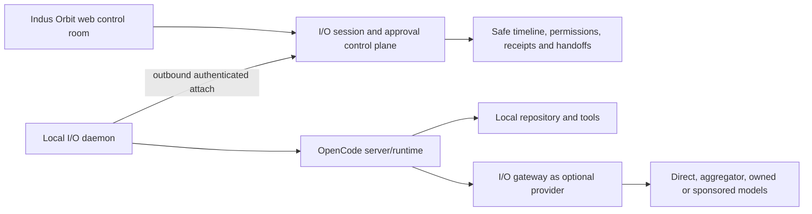

# OpenCode adoption plan for I/O Terminal

Status: implementation and remaining compatibility plan, updated 24 August 2026.

## Adoption decision

OpenCode is a strong MIT-licensed foundation for the local coding-agent runtime and protocol. I/O should use its server/OpenAPI/session/agent/tool concepts and, where appropriate, its SDK or separately built client components. I/O should not pretend that the current three-call proof equals the full OpenCode product, and should not merge OpenCode’s Solid UI wholesale into the React application.

OpenCode’s repository is MIT licensed; copied or substantially reused source must retain the required copyright and license notice. The official server exposes an OpenAPI-described HTTP API covering projects, paths/VCS, configuration, providers, sessions, messages, commands, files, experimental tools, LSP/formatters/MCP, agents, logs, auth and events. Its web application can share sessions with an attached terminal. Its agent configuration supports primary agents, subagents and granular wildcard `allow`/`ask`/`deny` permissions.

Official references:

- [OpenCode repository and license](https://github.com/anomalyco/opencode)
- [OpenCode documentation](https://opencode.ai/docs)
- [OpenCode server API](https://opencode.ai/docs/server/)
- [OpenCode web and terminal attachment](https://opencode.ai/docs/web/)
- [OpenCode agents and permissions](https://opencode.ai/docs/agents/)

## Capability adoption matrix

| OpenCode capability                      | Current I/O implementation                          | I/O adoption work                                                                                                                                                                  |
| ---------------------------------------- | --------------------------------------------------- | ---------------------------------------------------------------------------------------------------------------------------------------------------------------------------------- |
| Headless server and health               | Typed loopback client, health/version pairing       | Add explicit capability negotiation, supported-version matrix and daemon ownership.                                                                                                |
| Web plus attached terminal sharing state | Not integrated                                      | Let I/O register a local daemon and open/attach from branded web while terminal remains local; do not expose an unauthenticated listener.                                          |
| Projects and repository context          | Only user-entered local origin                      | Add project registration, safe display name/root fingerprint, workspace authorization and explicit external-directory permissions. Avoid sending raw local paths to cloud logs.    |
| Durable sessions/messages/parts          | Create, reconnect and continue exact local session  | Add archive/fork/private handoff; content remains local unless explicitly synchronized.                                                                                            |
| Primary agents and subagents             | Not implemented                                     | Map Observe/Plan/Build/Run to reviewed agent profiles; expose selected model, instruction source, permissions and child-agent activity.                                            |
| Granular tool permissions                | Pending permissions classified and rendered locally | Add complete policy profiles and server capability checks for ordered `allow`/`ask`/`deny`.                                                                                        |
| Approval UX                              | Exact once/reject bridge; critical approval blocked | Add step-up, revoke/expiry race tests and pinned real-daemon enforcement journeys.                                                                                                 |
| Tools and custom tools                   | Not implemented                                     | Render tool identity, arguments summary, state, output classification and duration; add schema/version allowlists and output size/redaction rules.                                 |
| Bash/terminal execution                  | Not integrated                                      | Stream bounded output locally, show working directory and exit state, enforce command/network/filesystem policy, support cancellation and prohibit implicit remote shell exposure. |
| Commands and prompt templates            | Not implemented                                     | Add reviewed workspace command catalogue with arguments, agent/model override, file references, ownership/version and permission preview.                                          |
| MCP integrations                         | Not implemented                                     | Add approved connector registry, OAuth/secret boundary, tool allowlists, data egress disclosure, timeout and revocation.                                                           |
| LSP and formatter status                 | Not implemented                                     | Surface language service/formatter availability and safe diagnostics; keep heavy processes local.                                                                                  |
| File search/read/edit                    | Not integrated into I/O UI                          | Add tree/search, diff-first edits, binary/large-file limits, external-directory gates and explicit artifact sharing.                                                               |
| Git/VCS, diffs and undo/redo             | Complete bounded local before/after diff review     | Add branch/status, checkpoint/revert, conflict handling and explicit commit/push authority. Never infer permission to publish.                                                     |
| Todos/task tree                          | Bounded parent/child session tree and todos         | Add fork creation, blocking reasons and handoff. Separate planning truth from model narration.                                                                                     |
| Event stream                             | Global SSE plus REST reconciliation Verified        | Pin versions, test disconnect/gap recovery, add safe dedupe/ordering evidence and keep prohibited content local.                                                                   |
| Provider/model abstraction               | Released scoped I/O API; OpenCode config unverified | Configure and test an entitled, commercially authorized route; retain local or BYOK escape paths.                                                                                  |
| Share links                              | Not adopted                                         | Replace public-by-convenience sharing with private, audience-bound, expiring, revocable I/O handoffs; recheck authorization on every open.                                         |
| SDK/OpenAPI generation                   | Separately buildable typed adapter package          | Pin a compatible upstream spec/version matrix and publish signed client artifacts.                                                                                                 |

### Verified 24 August implementation delta

- `packages/io-opencode-client` is a separately buildable typed adapter with loopback-only origins, strong in-memory Basic authentication, bounded JSON/SSE/diff parsing and fixture tests.
- `/global/event` is consumed with session filtering, `Last-Event-ID`, backoff and a reconnect budget. Each event schedules a REST refresh of tasks, diffs and pending permissions; SSE is never treated as an authorization or sole source of truth.
- The I/O workspace can continue the exact local session, render bounded parent/child tasks and todos, and inspect full local before/after file content without uploading it.
- A pending OpenCode permission is classified, recorded through the Released approval RPC, owner-decided once, then answered on the exact OpenCode request. Remembered approval is always false. Critical permission approval is disabled until step-up exists.
- This delta is **Verified locally**, not Released: no pinned real-OpenCode authenticated browser matrix or production web deployment has been completed.

## I/O Terminal target architecture



The browser must never become a generic remote shell. The local daemon owns filesystem/tool access and establishes the outbound authenticated relationship. The cloud control plane stores identity, policy, approvals and safe event projections; raw code, prompts and output stay local by default.

## Data that still needs to exist

```text
io_sessions
io_session_members
io_session_runtime_links
io_session_events
io_session_approval_requests
io_session_approval_decisions
io_session_tasks
io_session_artifacts
io_session_handoffs
io_session_checkpoints
io_agent_profiles
io_permission_policy_versions
io_connector_registrations
```

Each event/artifact type needs a content classification and sync policy. Database audit metadata must exclude secrets, raw environment variables and unrestricted terminal output.

## Implementation sequence

1. **Verified locally:** typed adapter, fixture tests, durable metadata/RLS, global SSE, REST reconciliation, continued prompts, child task trees, full diffs and once/reject permission bridge.
2. Pin supported OpenCode versions and run authenticated real-daemon browser contracts for every implemented route, including SSE disconnect/recovery and permission races.
3. Add capability negotiation, verified abort acknowledgement and fork creation.
4. Add Observe and Plan policy profiles first; prove mutation denial. Add Build/Run only with step-up, per-action approval and stricter command/network/filesystem policy.
5. Add command/tool output, MCP, LSP/formatter, repository context, checkpoint/revert and reviewed artifacts one bounded capability at a time.
6. Configure OpenCode against the Released scoped I/O model endpoint after one provider route is commercially authorized and conformed.
7. Add private handoff and multi-user review.
8. Replace the daemon password with a short-lived origin-bound pairing token, then package signed local daemon installers.
9. Design hosted runners as a separate security/operations programme after local V1 is proven.
